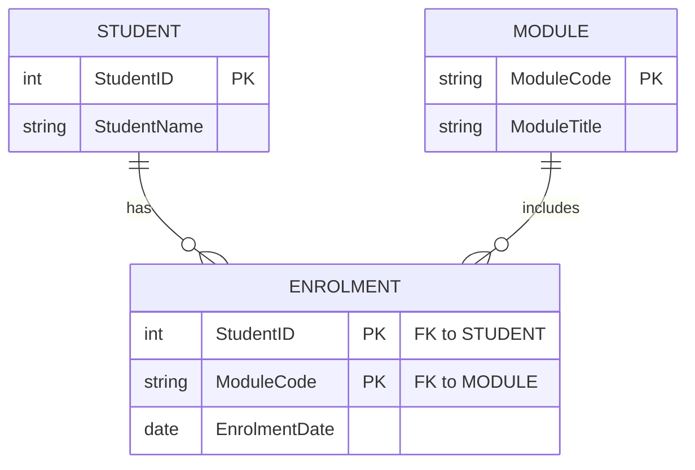
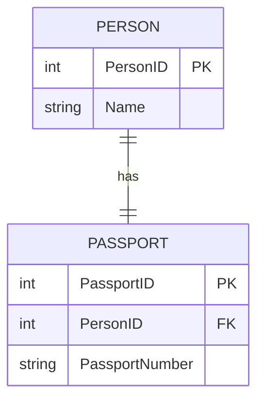
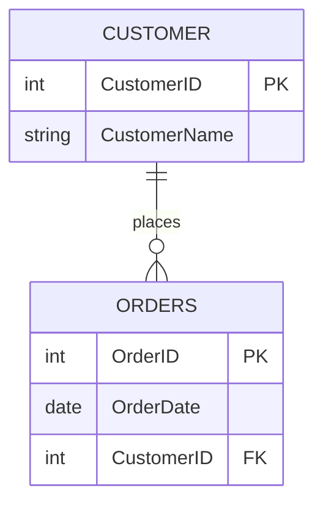
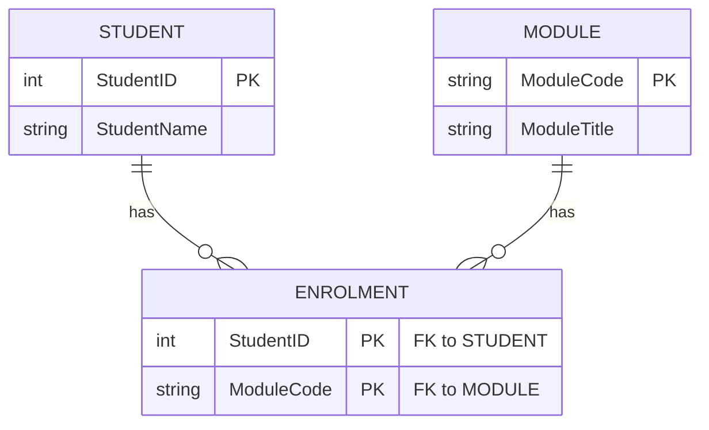
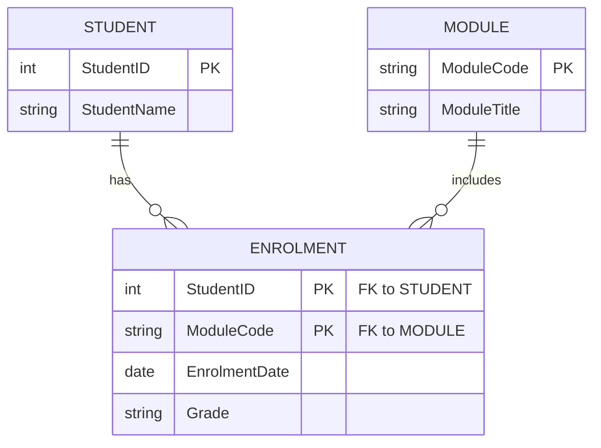
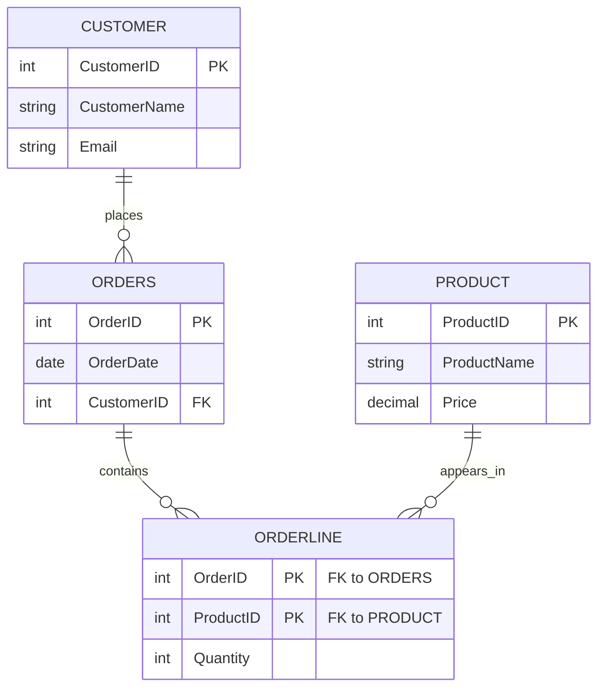

# SQL and ERD Comprehensive Guide

Sources: [Lecture Slides](<Lecture Slides>), [Condensed Database Notes.md](<Condensed Database Notes.md>)

This guide is for the COMP1004 database exam topics: entity relationship modelling, SQL DDL, and SQL DML. The goal is to be able to read a scenario, design the tables, and write queries against those tables.

## 1. The Big Picture

Database design and SQL fit together like this:

1. Read the scenario.
2. Identify the entities and relationships.
3. Draw or describe the ERD.
4. Convert the ERD into relational tables.
5. Add primary keys and foreign keys.
6. Use SQL DDL to create the tables.
7. Use SQL DML to insert, update, delete, and query the data.

Example scenario:

```text
A university stores students, modules, and which students are enrolled on which modules.
```

Possible ERD idea:

```text
Student -- enrols on -- Module
```

Visual ERD:


Because many students can enrol on many modules, the relational design needs a junction table:

```text
Student(StudentID, StudentName)
Module(ModuleCode, ModuleTitle)
Enrolment(StudentID, ModuleCode)
```

Relational ERD with the junction table included:



SQL then creates and queries those tables.

## 2. ERD Core Concepts

An entity relationship diagram, or ERD, models the important things in a system and the relationships between them.

### Entity

An entity is a type of thing the database needs to store data about.

Examples:

- `Student`
- `Module`
- `Customer`
- `Order`
- `Product`
- `Employee`

In an ERD, entities usually become tables.

### Attribute

An attribute is a piece of information stored about an entity.

Examples:

```text
Student(StudentID, StudentName, Email, DateOfBirth)
Product(ProductID, ProductName, Price)
```

In a relational database, attributes become columns.

### Primary Key

A primary key uniquely identifies each row in a table.

Good primary keys:

- `StudentID`
- `CustomerID`
- `OrderID`
- `ModuleCode`

Poor primary keys:

- `StudentName`, because two students can have the same name;
- `Email`, unless the system guarantees every email is unique and permanent;
- `Address`, because it is not unique and can change.

### Foreign Key

A foreign key is a column that refers to the primary key of another table.

Example:

```text
Student(StudentID, StudentName)
Enrolment(StudentID, ModuleCode)
```

`Enrolment.StudentID` is a foreign key referring to `Student.StudentID`.

Foreign keys show relationships between tables.

## 3. Cardinality

Cardinality describes how many instances of one entity can be associated with instances of another.

### One-to-One

One row in table A relates to one row in table B.

Example:

```text
Person -- has -- Passport
```

Visual:



Possible tables:

```text
Person(PersonID, Name)
Passport(PassportID, PersonID)
```

`PersonID` in `Passport` should be unique if each person can have only one passport in the model.

### One-to-Many

One row in table A can relate to many rows in table B.

Example:

```text
Customer -- places -- Order
```

Visual:



One customer can place many orders. Each order belongs to one customer.

Relational mapping:

```text
Customer(CustomerID, CustomerName)
Order(OrderID, OrderDate, CustomerID)
```

The foreign key goes on the many side. Here, `CustomerID` goes in `Order`.

### Many-to-Many

Many rows in table A can relate to many rows in table B.

Example:

```text
Student -- enrols on -- Module
```

High-level visual:


One student can take many modules. One module can have many students.

Relational mapping:

```text
Student(StudentID, StudentName)
Module(ModuleCode, ModuleTitle)
Enrolment(StudentID, ModuleCode)
```

The many-to-many relationship becomes a junction table. The junction table usually has a composite primary key made from the two foreign keys.

Implemented visual:



## 4. Optional and Mandatory Participation

Participation describes whether an entity must take part in a relationship.

Example:

```text
Customer -- places -- Order
```

Visual:


Possible rules:

- A customer may place zero or many orders.
- An order must belong to exactly one customer.

This affects whether a foreign key can be `NULL`.

If every order must have a customer:

```sql
CustomerID INT NOT NULL
```

If an order can exist without a known customer:

```sql
CustomerID INT
```

In exam answers, if the scenario uses words like "must", "can", "may", "one or more", or "zero or more", pay attention. Those words are usually cardinality clues.

## 5. ERD to Relational Mapping Rules

Use these rules as a checklist.

### Regular Entity

Each regular entity becomes a table.

```text
Student(StudentID, StudentName, Email)
```

The identifier becomes the primary key.

### One-to-Many Relationship

Put the primary key from the one side into the many side as a foreign key.

```text
Department(DepartmentID, DepartmentName)
Employee(EmployeeID, EmployeeName, DepartmentID)
```

`Employee.DepartmentID` is a foreign key.

SQL:

```sql
CREATE TABLE Department (
    DepartmentID INT PRIMARY KEY,
    DepartmentName VARCHAR(100) NOT NULL
);

CREATE TABLE Employee (
    EmployeeID INT PRIMARY KEY,
    EmployeeName VARCHAR(100) NOT NULL,
    DepartmentID INT NOT NULL,
    FOREIGN KEY (DepartmentID) REFERENCES Department(DepartmentID)
);
```

### Many-to-Many Relationship

Create a new table for the relationship.

```text
Student(StudentID, StudentName)
Module(ModuleCode, ModuleTitle)
Enrolment(StudentID, ModuleCode, EnrolmentDate)
```

SQL:

```sql
CREATE TABLE Enrolment (
    StudentID INT,
    ModuleCode VARCHAR(20),
    EnrolmentDate DATE,
    PRIMARY KEY (StudentID, ModuleCode),
    FOREIGN KEY (StudentID) REFERENCES Student(StudentID),
    FOREIGN KEY (ModuleCode) REFERENCES Module(ModuleCode)
);
```

### Relationship With Its Own Attributes

If a relationship has attributes, those attributes belong in the relationship table.

Example:

```text
Student enrols on Module on EnrolmentDate and receives Grade.
```

Visual:



Good design:

```text
Enrolment(StudentID, ModuleCode, EnrolmentDate, Grade)
```

Do not put `Grade` in `Student`, because a student has different grades for different modules.

Do not put `Grade` in `Module`, because a module has many students with different grades.

## 6. Common ERD Exam Mistakes

Common mistakes:

- treating a many-to-many relationship as a single foreign key;
- using names as primary keys;
- forgetting the foreign key;
- putting relationship attributes in the wrong table;
- not showing a composite primary key in a junction table;
- creating duplicated columns instead of a separate table.

Bad many-to-many design:

```text
Student(StudentID, StudentName, ModuleCode)
Module(ModuleCode, ModuleTitle)
```

This only works neatly if each student can take one module. If a student can take many modules, it causes repeated student data.

Better:

```text
Student(StudentID, StudentName)
Module(ModuleCode, ModuleTitle)
Enrolment(StudentID, ModuleCode)
```

## 7. SQL Categories

SQL has different categories.

DDL means data definition language. It defines database structures.

Common DDL:

- `CREATE TABLE`
- `ALTER TABLE`
- `DROP TABLE`

DML means data manipulation language. It works with the data.

Common DML:

- `INSERT`
- `UPDATE`
- `DELETE`
- `SELECT`

In your exam, SQL query writing is likely to focus heavily on `SELECT`, but you should still know table creation and constraints.

## 8. SQL Data Types

Common types:

- `INT`: whole number;
- `DECIMAL(p, s)`: exact decimal number, useful for money;
- `VARCHAR(n)`: variable-length string;
- `CHAR(n)`: fixed-length string;
- `DATE`: calendar date;
- `TIME`: time;
- `BOOLEAN`: true or false, depending on DBMS support.

Examples:

```sql
Price DECIMAL(8, 2)
StudentName VARCHAR(100)
DateOfBirth DATE
Quantity INT
```

`DECIMAL(8, 2)` means up to 8 digits total, with 2 after the decimal point.

## 9. Creating Tables

Basic shape:

```sql
CREATE TABLE TableName (
    ColumnName DataType Constraint,
    ColumnName DataType Constraint
);
```

Example:

```sql
CREATE TABLE Product (
    ProductID INT PRIMARY KEY,
    ProductName VARCHAR(100) NOT NULL,
    Price DECIMAL(8, 2) NOT NULL,
    StockQuantity INT DEFAULT 0
);
```

With a foreign key:

```sql
CREATE TABLE Orders (
    OrderID INT PRIMARY KEY,
    OrderDate DATE NOT NULL,
    CustomerID INT NOT NULL,
    FOREIGN KEY (CustomerID) REFERENCES Customer(CustomerID)
);
```

## 10. Constraints

Constraints enforce rules.

### PRIMARY KEY

Uniquely identifies a row.

```sql
StudentID INT PRIMARY KEY
```

Composite primary key:

```sql
PRIMARY KEY (StudentID, ModuleCode)
```

### FOREIGN KEY

Ensures a value exists in another table.

```sql
FOREIGN KEY (CustomerID) REFERENCES Customer(CustomerID)
```

### NOT NULL

The column must have a value.

```sql
StudentName VARCHAR(100) NOT NULL
```

### UNIQUE

No two rows can have the same value.

```sql
Email VARCHAR(255) UNIQUE
```

### CHECK

The value must satisfy a condition.

```sql
Price DECIMAL(8, 2) CHECK (Price >= 0)
```

### DEFAULT

Supplies a value if none is given.

```sql
StockQuantity INT DEFAULT 0
```

## 11. ALTER TABLE and DROP TABLE

`ALTER TABLE` changes an existing table.

Add a column:

```sql
ALTER TABLE Student
ADD PhoneNumber VARCHAR(20);
```

Drop a column:

```sql
ALTER TABLE Student
DROP COLUMN PhoneNumber;
```

`DROP TABLE` deletes a table structure and its data.

```sql
DROP TABLE Student;
```

Be careful: `DROP TABLE` removes the whole table, not just the rows.

## 12. INSERT

`INSERT` adds rows.

```sql
INSERT INTO Student (StudentID, StudentName, Email)
VALUES (1001, 'Asha Khan', 'asha@example.com');
```

Multiple rows:

```sql
INSERT INTO Student (StudentID, StudentName, Email)
VALUES
    (1001, 'Asha Khan', 'asha@example.com'),
    (1002, 'Ben Smith', 'ben@example.com');
```

If a column has a default value or allows `NULL`, you may omit it.

## 13. UPDATE

`UPDATE` changes existing rows.

```sql
UPDATE Student
SET Email = 'asha.khan@example.com'
WHERE StudentID = 1001;
```

Multiple columns:

```sql
UPDATE Product
SET Price = 19.99,
    StockQuantity = 50
WHERE ProductID = 10;
```

Exam warning: if you forget `WHERE`, the update affects every row.

```sql
UPDATE Product
SET Price = 19.99;
```

That changes every product price.

## 14. DELETE

`DELETE` removes rows.

```sql
DELETE FROM Student
WHERE StudentID = 1001;
```

Exam warning: if you forget `WHERE`, the delete affects every row.

```sql
DELETE FROM Student;
```

That removes all rows from `Student`, while keeping the table structure.

## 15. SELECT Basics

`SELECT` retrieves data.

All columns:

```sql
SELECT *
FROM Student;
```

Specific columns:

```sql
SELECT StudentName, Email
FROM Student;
```

Rename an output column:

```sql
SELECT StudentName AS Name
FROM Student;
```

Remove duplicates:

```sql
SELECT DISTINCT Course
FROM Student;
```

## 16. WHERE

`WHERE` filters rows.

```sql
SELECT StudentName
FROM Student
WHERE Course = 'Computer Science';
```

Comparison operators:

- `=`
- `<>`
- `<`
- `>`
- `<=`
- `>=`

Logical operators:

- `AND`
- `OR`
- `NOT`

Example:

```sql
SELECT ProductName, Price
FROM Product
WHERE Price >= 10 AND Price <= 50;
```

## 17. LIKE, IN, BETWEEN, and NULL

`LIKE` matches patterns.

```sql
SELECT StudentName
FROM Student
WHERE StudentName LIKE 'A%';
```

`A%` means starts with `A`.

`IN` checks whether a value is in a list.

```sql
SELECT ModuleTitle
FROM Module
WHERE ModuleCode IN ('COMP1001', 'COMP1004');
```

`BETWEEN` checks a range.

```sql
SELECT ProductName
FROM Product
WHERE Price BETWEEN 10 AND 50;
```

Use `IS NULL` for missing values.

```sql
SELECT StudentName
FROM Student
WHERE Email IS NULL;
```

Do not write:

```sql
WHERE Email = NULL
```

## 18. ORDER BY

`ORDER BY` sorts results.

```sql
SELECT StudentName, Email
FROM Student
ORDER BY StudentName;
```

Descending order:

```sql
SELECT ProductName, Price
FROM Product
ORDER BY Price DESC;
```

Multiple sort columns:

```sql
SELECT StudentName, Course
FROM Student
ORDER BY Course, StudentName;
```

## 19. Aggregate Functions

Aggregate functions calculate one value from many rows.

Common aggregates:

- `COUNT(*)`: number of rows;
- `COUNT(ColumnName)`: number of non-null values in a column;
- `SUM(ColumnName)`: total;
- `AVG(ColumnName)`: average;
- `MIN(ColumnName)`: smallest value;
- `MAX(ColumnName)`: largest value.

Examples:

```sql
SELECT COUNT(*) AS NumberOfStudents
FROM Student;
```

```sql
SELECT AVG(Price) AS AveragePrice
FROM Product;
```

```sql
SELECT MIN(Price) AS CheapestPrice,
       MAX(Price) AS MostExpensivePrice
FROM Product;
```

## 20. GROUP BY

`GROUP BY` puts rows into groups, then aggregates each group.

Example:

```sql
SELECT Course, COUNT(*) AS NumberOfStudents
FROM Student
GROUP BY Course;
```

This gives one result per course.

Rule: if you use an aggregate and also select a normal column, the normal column usually needs to appear in `GROUP BY`.

Good:

```sql
SELECT Course, COUNT(*)
FROM Student
GROUP BY Course;
```

Bad:

```sql
SELECT Course, StudentName, COUNT(*)
FROM Student
GROUP BY Course;
```

`StudentName` is not grouped or aggregated, so this is not a valid grouped query in standard SQL.

## 21. HAVING

`HAVING` filters groups after grouping.

Example:

```sql
SELECT Course, COUNT(*) AS NumberOfStudents
FROM Student
GROUP BY Course
HAVING COUNT(*) > 10;
```

Use `WHERE` before grouping:

```sql
SELECT Course, COUNT(*) AS NumberOfStudents
FROM Student
WHERE YearOfStudy = 1
GROUP BY Course;
```

Use `HAVING` after grouping:

```sql
SELECT Course, COUNT(*) AS NumberOfStudents
FROM Student
GROUP BY Course
HAVING COUNT(*) > 10;
```

Memory rule:

```text
WHERE filters rows.
HAVING filters groups.
```

## 22. Joins

Joins combine data from multiple tables.

Example tables:

```text
Student(StudentID, StudentName)
Module(ModuleCode, ModuleTitle)
Enrolment(StudentID, ModuleCode)
```

Find student names with module titles:

```sql
SELECT Student.StudentName, Module.ModuleTitle
FROM Student
JOIN Enrolment ON Student.StudentID = Enrolment.StudentID
JOIN Module ON Enrolment.ModuleCode = Module.ModuleCode;
```

This follows the foreign key links:

```text
Student -> Enrolment -> Module
```

### INNER JOIN

An inner join returns only matching rows.

```sql
SELECT Customer.CustomerName, Orders.OrderDate
FROM Customer
JOIN Orders ON Customer.CustomerID = Orders.CustomerID;
```

Only customers with matching orders appear.

### LEFT JOIN

A left join returns all rows from the left table and matching rows from the right table.

```sql
SELECT Customer.CustomerName, Orders.OrderDate
FROM Customer
LEFT JOIN Orders ON Customer.CustomerID = Orders.CustomerID;
```

Customers with no orders still appear, with `NULL` order values.

Even if your lecture examples mostly use plain `JOIN`, knowing the idea of left joins helps with questions like "show all customers, including those with no orders".

## 23. Subqueries

A subquery is a query inside another query.

Example:

```sql
SELECT StudentName
FROM Student
WHERE StudentID IN (
    SELECT StudentID
    FROM Enrolment
    WHERE ModuleCode = 'COMP1004'
);
```

The inner query finds IDs of students enrolled on `COMP1004`. The outer query gets their names.

Subquery with aggregate:

```sql
SELECT ProductName, Price
FROM Product
WHERE Price > (
    SELECT AVG(Price)
    FROM Product
);
```

This finds products costing more than the average price.

## 24. Query Writing Method

When you see a SQL question, do this:

1. Identify the output columns.
2. Identify the table or tables needed.
3. If multiple tables are needed, find the join path.
4. Add row filters with `WHERE`.
5. Add aggregation if the question asks for totals, counts, averages, maximums, or minimums.
6. Add `GROUP BY` if the aggregate is per category.
7. Add `HAVING` if filtering aggregate results.
8. Add `ORDER BY` if sorting is requested.

Example question:

```text
List each module code and the number of students enrolled on it, but only show modules with more than 20 students.
```

Answer:

```sql
SELECT ModuleCode, COUNT(*) AS NumberOfStudents
FROM Enrolment
GROUP BY ModuleCode
HAVING COUNT(*) > 20;
```

Why:

- output columns: `ModuleCode`, count of students;
- table needed: `Enrolment`;
- per module means `GROUP BY ModuleCode`;
- "more than 20 students" applies to a group, so use `HAVING`.

## 25. End-to-End Worked Example

Scenario:

```text
A shop stores customers, orders, and products.
Each customer can place many orders.
Each order can contain many products.
Each product can appear in many orders.
For each product in an order, the system stores the quantity.
```

### ERD Reasoning

Entities:

- `Customer`
- `Order`
- `Product`

Relationships:

- one customer places many orders;
- one order belongs to one customer;
- many orders contain many products;
- many products appear in many orders.

The many-to-many relationship between `Order` and `Product` needs a junction table.

### Visual ERD



### Relational Schema

```text
Customer(CustomerID, CustomerName, Email)
Orders(OrderID, OrderDate, CustomerID)
Product(ProductID, ProductName, Price)
OrderLine(OrderID, ProductID, Quantity)
```

### SQL DDL

```sql
CREATE TABLE Customer (
    CustomerID INT PRIMARY KEY,
    CustomerName VARCHAR(100) NOT NULL,
    Email VARCHAR(255) UNIQUE
);

CREATE TABLE Orders (
    OrderID INT PRIMARY KEY,
    OrderDate DATE NOT NULL,
    CustomerID INT NOT NULL,
    FOREIGN KEY (CustomerID) REFERENCES Customer(CustomerID)
);

CREATE TABLE Product (
    ProductID INT PRIMARY KEY,
    ProductName VARCHAR(100) NOT NULL,
    Price DECIMAL(8, 2) NOT NULL CHECK (Price >= 0)
);

CREATE TABLE OrderLine (
    OrderID INT,
    ProductID INT,
    Quantity INT NOT NULL CHECK (Quantity > 0),
    PRIMARY KEY (OrderID, ProductID),
    FOREIGN KEY (OrderID) REFERENCES Orders(OrderID),
    FOREIGN KEY (ProductID) REFERENCES Product(ProductID)
);
```

### SQL Query

Question:

```text
Show each order ID, customer name, product name, quantity, and line total.
```

Answer:

```sql
SELECT Orders.OrderID,
       Customer.CustomerName,
       Product.ProductName,
       OrderLine.Quantity,
       Product.Price * OrderLine.Quantity AS LineTotal
FROM Orders
JOIN Customer ON Orders.CustomerID = Customer.CustomerID
JOIN OrderLine ON Orders.OrderID = OrderLine.OrderID
JOIN Product ON OrderLine.ProductID = Product.ProductID;
```

## 26. SQL Syntax Order

The usual written order is:

```sql
SELECT
FROM
JOIN
WHERE
GROUP BY
HAVING
ORDER BY
```

Example:

```sql
SELECT Course, COUNT(*) AS NumberOfStudents
FROM Student
WHERE YearOfStudy = 1
GROUP BY Course
HAVING COUNT(*) >= 5
ORDER BY NumberOfStudents DESC;
```

The database processes the query logically in a slightly different order, but for exam writing, memorise the written order.

## 27. Quick Reference

### ERD Mapping

```text
Entity -> table
Attribute -> column
Identifier -> primary key
One-to-many -> foreign key on many side
Many-to-many -> junction table
Relationship attribute -> column in relationship table
```

### SQL DDL

```sql
CREATE TABLE TableName (
    ID INT PRIMARY KEY,
    Name VARCHAR(100) NOT NULL,
    OtherID INT,
    FOREIGN KEY (OtherID) REFERENCES OtherTable(OtherID)
);
```

### SQL DML

```sql
INSERT INTO TableName (Column1, Column2)
VALUES (Value1, Value2);

UPDATE TableName
SET Column1 = Value1
WHERE condition;

DELETE FROM TableName
WHERE condition;

SELECT Column1, Column2
FROM TableName
WHERE condition;
```

### Grouped Query

```sql
SELECT CategoryColumn, COUNT(*) AS Total
FROM TableName
WHERE row_condition
GROUP BY CategoryColumn
HAVING COUNT(*) > 5
ORDER BY Total DESC;
```

### Join Query

```sql
SELECT A.ColumnName, B.ColumnName
FROM A
JOIN B ON A.KeyColumn = B.KeyColumn;
```

## 28. Mini Practice Questions

1. A library stores books and authors. Each book has one author, but an author can write many books. Write the relational schema.
2. A doctor can see many patients, and a patient can see many doctors. Each appointment has a date and time. Write the relational schema.
3. Write SQL to create a `Module` table with `ModuleCode` as the primary key and `ModuleTitle` as required text.
4. Write SQL to list all students on `COMP1004`.
5. Write SQL to count how many students are on each module.
6. Write SQL to show only modules with more than 30 students.
7. Explain why a many-to-many relationship needs a junction table.
8. Explain the difference between `WHERE` and `HAVING`.

## 29. Answer Sketches

1.

```text
Author(AuthorID, AuthorName)
Book(BookID, BookTitle, AuthorID)
```

2.

```text
Doctor(DoctorID, DoctorName)
Patient(PatientID, PatientName)
Appointment(DoctorID, PatientID, AppointmentDateTime)
```

3.

```sql
CREATE TABLE Module (
    ModuleCode VARCHAR(20) PRIMARY KEY,
    ModuleTitle VARCHAR(100) NOT NULL
);
```

4.

```sql
SELECT Student.StudentName
FROM Student
JOIN Enrolment ON Student.StudentID = Enrolment.StudentID
WHERE Enrolment.ModuleCode = 'COMP1004';
```

5.

```sql
SELECT ModuleCode, COUNT(*) AS NumberOfStudents
FROM Enrolment
GROUP BY ModuleCode;
```

6.

```sql
SELECT ModuleCode, COUNT(*) AS NumberOfStudents
FROM Enrolment
GROUP BY ModuleCode
HAVING COUNT(*) > 30;
```

7. A many-to-many relationship needs a junction table because one foreign key cannot store multiple matches cleanly without repeating data or breaking 1NF.

8. `WHERE` filters individual rows before grouping. `HAVING` filters grouped results after `GROUP BY`.
