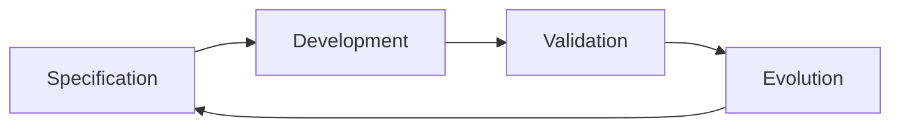
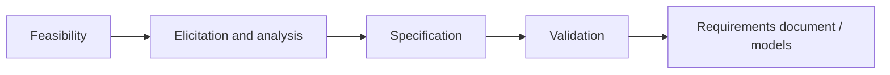
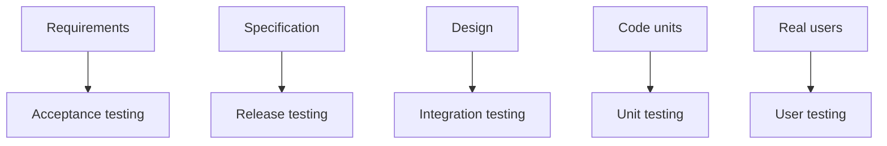
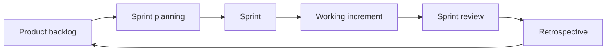
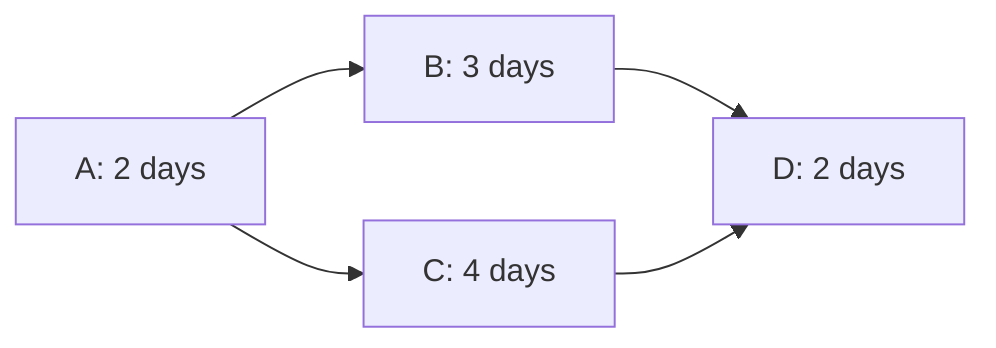

# COMP1003 Software Engineering Exam Guide

Source files used:
- `Exam and Revision/COMP1003 - Exam Briefing.pdf`
- `Exam and Revision/Practice Questions/*.pdf`
- `Exam and Revision/Past Papers/*.pdf`
- `Lecture Slides/*.pdf`
- `Required Reading Notes/*.md`

Coverage note:
- The folder currently contains lectures `01-19`.
- Required reading has been summarised separately in `Required Reading Notes`.

## Current Exam Facts

- Module: COMP1003 Software Engineering.
- Exam weighting: 50% of the module.
- Total marks: 50.
- Time: 120 minutes.
- Structure: 3 sections, A, B, and C.
- You answer all questions in all sections.
- Questions focus on software engineering principles taught in lectures, labs, and expected reading.
- Expected reading can be examined.

Older past papers in the folder use a 20/15/15 split:
- Section A: Software engineering activities / software quality, 20 marks.
- Section B: project management and risk, 15 marks.
- Section C: agile methodologies, 15 marks.

Treat that split as a useful practice pattern, not a guaranteed promise unless the current paper says it.

## How To Answer

- Match the number of points to the marks.
- If a question asks for 4 bullet points, write 4 bullet points.
- Aim for 1 mark per clear point unless the wording says otherwise.
- Use concise answers: usually 1 or 2 sentences per bullet.
- Do not bury marks inside long paragraphs.
- Make each point easy for the marker to find.
- Do not spend too long on low-mark questions. A 4-mark question is not worth 20 minutes.
- When asked to identify and describe, give the name and a short explanation.
- When asked for examples, make the example concrete and tied to the scenario.
- When asked to compare, explicitly say how the two things differ.
- When asked to apply to a scenario, quote or refer to scenario details and explain why they matter.

## Revision Priorities

High priority themes that appear repeatedly:
- Four fundamental software engineering activities: specification, development, validation, evolution.
- Why software engineering exists: scale, teams, reliability, cost, schedule, and real users.
- Process models: waterfall, V-model, iterative/agile, spiral.
- Difference between requirements and specifications.
- Functional vs non-functional requirements/specifications.
- Requirements elicitation, modelling, validation, and change management.
- UML as both requirements modelling and specification/design modelling.
- Prototyping: purposes, fidelity, benefits, and risks.
- Implementation quality: coding standards, pair programming, maintainability, debugging.
- Testing stages: unit, integration, release, acceptance, user testing.
- Test-driven development and test planning.
- Continuous integration, automated testing, configuration management, deployment.
- Git/version control for teamwork: pull before push, conflicts, commits, tags, branches, merge requests.
- Software evolution and maintenance.
- Software quality management and quality assurance.
- Software risks vs project risks.
- Risk strategies: avoidance, minimisation/mitigation, contingency.
- Project planning: task breakdown, dependencies, Gantt charts, critical path, staffing problems.
- Agile values, Scrum, user stories, and choosing agile vs plan-based approaches.

After reviewing the required reading, the weighting should be read like this:
- Requirements engineering is the strongest overall theme: requirements failure, elicitation, stakeholder involvement, validation, and non-functional requirements.
- Maintainability is more important than the lecture-only view suggests: coding conventions, refactoring, technical debt, code review, pair programming, automated tests, CI, and version control.
- TDD deserves explicit revision: failing test, minimal code, refactor, repeat; know benefits and pitfalls.
- Specifications and UML should be treated as communication tools: specs must be readable, diagrams must help validate behaviour, and models should be useful rather than overproduced.
- Usability/accessibility and authorization/security are likely scenario-answer enrichers, especially where users or sensitive data are involved.

See `Required Reading Notes/02 - Reweighted Exam Priorities After Required Reading.md` for the full revised priority list.

## Visual Diagrams To Know

These are the visual patterns most worth being able to recognise, explain, or sketch quickly.

Four software engineering activities:

Requirements engineering:

Testing levels:

Scrum cycle:

Critical-path pattern:

In the critical-path example, `A-C-D` is the controlling path because `2 + 4 + 2 = 8`, while `A-B-D` is `2 + 3 + 2 = 7`.

## Core Concepts

### Why Software Engineering Exists

Software engineering is needed because real software is larger and riskier than a single program written by one person.

Real software often includes:
- Compiled code.
- Documentation.
- Configuration files.
- Installation/update/deployment components.
- Version history across platforms.
- Integration with servers, databases, APIs, or other services.
- Multiple users, developers, releases, and changing requirements.

Software engineering is about using systematic, organised methods to build, operate, and maintain software. It matters because poor software engineering causes unreliable systems, missed deadlines, cost overruns, poor requirements, communication breakdown, and insufficient testing.

Useful failure causes to mention:
- Poor requirements.
- Communication breakdown.
- Skipping or weakening testing.
- Changing code without planning.
- Cutting corners under schedule pressure.
- Choosing tools because they are familiar rather than suitable.

### Process Models

Waterfall:
Sequential stages: requirements, design, implementation/unit testing, integration/system testing, operation/maintenance. It is clear and structured, but assumes stable requirements and makes change expensive.

V-model:
Pairs development stages with corresponding testing/validation stages. It is good for showing how requirements/design decisions should be tested, but can still be rigid.

Iterative/agile models:
Specification, development, and validation overlap through repeated increments. Useful when requirements are uncertain and feedback is needed.

Spiral model:
Iterative model organised around risk analysis, prototyping, planning the next phase, and review. Good when risk needs to be assessed repeatedly.

Traditional methods are often stronger when documentation, regulation, stable requirements, or large teams matter. Agile methods are often stronger when change, feedback, and incremental delivery matter.

### Four Fundamental Activities

Specification:
Define what the system should do and the constraints it must satisfy.

Development:
Design and implement the software.

Validation:
Check that the software meets requirements and is fit for its intended use.

Evolution:
Change and maintain the software after feedback, new requirements, defects, or changed environments.

### Requirements vs Specifications

Requirements:
What users, clients, or stakeholders need the system to do. They describe the problem and desired behaviour from the user/client perspective.

Specifications:
How the system will be built to satisfy the requirements. They are more technical and guide design, implementation, and testing.

Example using UML:
- A sequence diagram at requirements level can show a user's interaction with the system.
- A sequence diagram at specification/design level can show how classes or components call each other internally.

### Functional vs Non-Functional

Functional:
What the system does. Example: users can reset their password.

Non-functional:
Qualities, constraints, and limits on how the system performs. Example: password reset emails must arrive within 60 seconds; data must be encrypted; the interface must meet accessibility standards.

### Requirements Validation

Requirements validation checks that the captured requirements are correct, realistic, and useful before committing to later work.

Useful techniques:
- Reviews/inspections with stakeholders.
- Prototyping to check understanding.
- Test-case derivation: ask whether each requirement can be tested.
- Consistency checks: find contradictions between requirements.
- Feasibility checks: check technical, cost, time, legal, and organisational constraints.
- Traceability checks: link requirements back to stakeholders and forward to specifications/tests.

### Requirements Documents

Requirements documents are used by:
- Clients and users to confirm what is being built.
- Project managers to plan work, cost, and schedule.
- Developers/designers to produce specifications and designs.
- Testers to plan acceptance and release tests.
- Maintenance teams to understand intended behaviour later.

### Requirements Change Management

Requirements change management is the controlled process for handling proposed changes to requirements.

Why it matters:
- Prevents uncontrolled scope creep.
- Lets the team assess cost, risk, schedule, and quality impact.
- Preserves traceability between requirements, specifications, code, and tests.
- Keeps stakeholders aligned on what is actually being built.
- Is especially important during maintenance/evolution, because changes can break existing behaviour.

## Modelling, Design, and Prototyping

### UML and Requirements Modelling

Models help teams understand, communicate, and check requirements before committing to implementation.

Common UML uses:
- Use case diagrams: actors and system goals.
- Activity diagrams: workflows and processes.
- Sequence diagrams: interactions over time.
- Class diagrams: domain concepts or software classes, depending on abstraction level.

Key exam point:
The same diagram type can be used at different levels. For requirements, it captures user/system behaviour. For specification/design, it captures technical structure or implementation behaviour.

### Prototypes

Prototypes are high-level designs used to explore, communicate, or test ideas before full implementation.

Common roles:
- Exploratory prototype: discover requirements or compare ideas.
- Throwaway prototype: learn something, then discard it.
- Evolutionary prototype: gradually develop into the final product.
- Communication prototype: help clients/users understand and comment on a design.

Low-fidelity prototype:
Cheap, rough, fast. Example: paper sketches, wireframes.

High-fidelity prototype:
More realistic, interactive, and polished. Example: clickable UI prototype or partial implementation.

Risks of prototyping:
- Too much work is spent building a prototype just to make a small decision.
- Prototype code accidentally becomes production code.
- Prototype is used instead of proper documentation/specification.
- The wrong stakeholders approve it.
- Users mistake the prototype for the finished system.

## Implementation Quality

### Coding Standards and Conventions

Coding standards improve quality because they:
- Make code easier for other developers to read and maintain.
- Reduce avoidable errors and inconsistencies.
- Make code reviews more effective.
- Help teams integrate work from multiple developers.
- Support long-term evolution by making structure predictable.

### Pair Programming

Pair programming can improve quality by:
- Providing continuous review while code is written.
- Sharing knowledge across the team.
- Reducing dependence on one developer.
- Helping junior developers learn from experienced developers.
- Catching design or logic problems earlier.
- Improving consistency with team standards.

Pair programming can also mitigate project risk when a key developer may be unavailable, because more than one person understands important code.

### Debugging

Testing finds that a bug exists; debugging locates and removes its cause.

Useful debugging approaches:
- Breakpoints and stepping through code.
- Variable inspection and trace tables.
- Logging/print statements.
- Hypothesis testing: list possible causes and test them.
- Binary search through code paths.
- Change one thing at a time.
- Keep track of what has already been ruled out.

Avoid random changes without a theory, because they can hide the real problem or introduce new ones.

## Testing

### Testing Stages

Unit testing:
Tests individual units/classes/functions. Usually done by developers, often many times per day.

Integration testing:
Tests combinations of units and how components work together. Often done by the development team.

Release testing:
Tests the complete system against the functional and non-functional specification before showing or releasing it to the client. Usually done by a testing team independent from the developers.

Acceptance testing:
Checks whether the client/customer accepts that the system satisfies user requirements and contract expectations. Failure may send work back to requirements or specification, not just coding.

User testing:
Real users try the software in realistic use. Alpha/beta testing can start the evolution phase by revealing new defects, needs, or improvements.

### Release vs Acceptance Testing

Release testing:
- Internal.
- Based on full functional and non-functional specification.
- Shows the team whether the product is ready to present/release.
- Failures usually go back to developers/testers.

Acceptance testing:
- Involves client/customer acceptance.
- Based on user requirements and business expectations.
- Supports sign-off/payment/end-of-contract decisions.
- Failures can imply wrong or incomplete requirements.

### Acceptance Testing Is Not Only At The End

Acceptance should be considered throughout the process:
- Validate requirements with clients early.
- Use prototypes to get client feedback.
- Review specifications and designs with stakeholders.
- Agree acceptance criteria before implementation.
- Test partial deliverables or sprint increments.

This improves quality because the team gets feedback before mistakes become expensive.

## CI, Configuration, Deployment, and Maintenance

### Continuous Integration

Continuous integration means developers frequently integrate code into the shared mainline, with automated checks to keep the product working.

A strong CI process may include:
- Developers commit/push changes frequently.
- Automated unit/integration tests run on each change.
- The system is built automatically.
- Different configuration scripts build for different platforms or platform versions.
- Builds are deployed to real or virtual test machines.
- Logs and test results are checked so failures are found quickly.

Exam phrasing to remember:
CI can show software is ready for deployment by combining automated testing, platform-specific builds/configuration, and deployment/testing on target environments.

### Configuration Management

Configuration management controls versions, builds, dependencies, and platform-specific settings.

It helps produce software for multiple platforms by:
- Maintaining separate build configurations for each platform/version.
- Recording dependencies, compiler/build settings, libraries, and environment assumptions.
- Automating builds so each target is repeatable.
- Keeping version histories so releases can be reproduced or patched.

### Advanced Version Control

Know the purpose of:
- Fork: create a personal copy of someone else's repository.
- Clone: download a repository to your local machine.
- Status: check the state of your working directory.
- Diff: see changes between versions of files.
- Add: stage changes before committing.
- Commit: save a snapshot of changes to version history.
- Push: upload local commits to the remote repository.
- Pull: bring remote changes into your local copy.
- Pull before push.
- Branches for isolated work.
- Feature branches.
- Merging branches back into main.
- Resolving conflicts.
- Stashing uncommitted work when switching tasks.
- Release branches for stabilising deployable versions.
- Tags for naming important commits or releases.
- `.gitignore` for excluding generated/build files from version control.
- Merge requests/code reviews for checking work before it is accepted.

Version control supports team coordination, code review, traceability, and safer change management.

Git is designed to protect code by keeping history, allowing old versions to be recovered, making teamwork safer, and warning when someone else has changed the shared project before you push.

### Evolution and Maintenance

Evolution/maintenance is changing software after initial delivery.

Three common change types:
- Corrective: fixing faults/bugs.
- Adaptive: changing software for a new environment, platform, API, or law.
- Perfective: improving features, performance, usability, maintainability, or adding requested improvements.

Maintenance links back to requirements change management because new or changed requirements must be assessed, specified, implemented, tested, and traced.

Key maintenance/change-management points:
- Maintenance is usually the longest lifecycle phase.
- Change after delivery is expensive because it can affect requirements, specifications, architecture, code, and acceptance tests.
- Do not start by changing code arbitrarily; first understand the change, cost, scope, and contract implications.
- Emergency fixes should be documented and later revisited properly.
- Repeated quick fixes can make code harder to maintain.
- Refactoring is preventative maintenance: improving code structure to reduce future change cost.
- Evolution is best treated as another software engineering loop: specify, implement, validate, release, then repeat.

## Software Quality

### Quality Is Pervasive

Software quality is not just a testing stage. Quality should be planned and managed across the whole software engineering process.

Examples of quality activities:
- Requirements validation.
- Specification inspections.
- Prototype reviews with clients/users.
- Code standards and code reviews.
- Pair programming.
- Testing protocols.
- Release testing by teams independent from developers.
- Documentation standards.
- Traceability between requirements, designs, code, and tests.

### QA Team Responsibilities

A software quality assurance team may:
- Plan for quality across projects.
- Define standards and procedures.
- Check whether projects follow company standards.
- Identify inspection points.
- Identify useful quality measures.
- Improve testing protocols.
- Keep quality concerns separate from short-term developer pressure.

Depending only on the testing team for quality is risky because:
- Problems found at the end are expensive to fix.
- Late failures can delay release.
- Testing cannot easily repair bad requirements or poor specifications.
- Quality defects may already be embedded in design decisions.

### Four Software Quality Management Activities

A useful four-point answer can include:
- Quality planning: decide standards, procedures, responsibilities, and quality goals.
- Quality assurance: define and maintain processes that should lead to quality.
- Quality control/checking: inspect outputs and check compliance with standards.
- Process improvement/measurement: use defects, reviews, and metrics to improve the process.

## Risks and Project Planning

### Software Risks vs Project Risks

Software risks:
Risks in the product itself, such as security, dependability, privacy, data protection, safety, correctness, or platform compatibility.

Project risks:
Risks to successful delivery, such as staff illness, delays, cost overruns, loss of expertise, unclear requirements, or dependency problems.

How software risks affect requirements engineering:
- They create new requirements, including non-functional requirements.
- They may create "shall not" requirements: things the system must prevent.
- They require early functional risk analysis.
- They affect specifications, designs, and test plans.
- They increase the need for validation and traceability.

### Risk Strategies

Avoidance:
Change the plan so the risk is removed or made irrelevant.

Example:
Do not use an unfamiliar technology if the project cannot absorb the learning risk.

Minimisation/mitigation:
Reduce the probability or impact of the risk.

Example:
Use pair programming so knowledge is shared if a key developer becomes unavailable.

Contingency:
Prepare a backup plan in case the risk happens.

Example:
Have a contractor, backup developer, or alternate schedule ready if a specialist is absent.

### Project Planning

Know how to:
- Break work into tasks.
- Estimate durations.
- Identify dependencies.
- Draw or interpret a Gantt chart.
- Find the critical path.
- Identify staffing conflicts.
- Delay non-critical tasks without extending the critical path.
- Use milestones.

Critical path:
The sequence of dependent tasks that determines the shortest possible project duration. Delays on the critical path delay the whole project.

Staffing problem:
Occurs when scheduled tasks require more people than are available at the same time.

To solve a staffing problem without extending the project:
- Find a task causing the overload.
- Check if it has slack/float.
- Delay that task within its available slack.
- Avoid delaying critical-path tasks unless unavoidable.

### Gantt, Critical Path, and Staffing Method

For planning questions, do the mechanics before writing the explanation.

1. List each task, duration, dependencies, and staff requirement.
2. For each task, find the earliest start time: it can only start after all predecessor tasks are complete.
3. Find each earliest finish time: earliest start plus duration.
4. The project duration is the latest earliest finish time among the final tasks.
5. Trace backwards from the final task through the dependency chain that controls the finish date. This is the critical path.
6. Check staffing by counting how many people are needed in each time period.
7. If there is a staffing clash, move a non-critical task into its slack if possible.

Useful exam wording:
- A task is on the critical path if delaying it delays the whole project.
- Slack/float is the amount of time a task can be delayed without delaying the project finish.
- A staffing conflict happens when the schedule requires more people at the same time than are available.
- A good fix moves non-critical work, not critical-path work, unless there is no alternative.

Small worked pattern:

| Task | Duration | Depends on |
| ---- | -------- | ---------- |
| A | 2 days | none |
| B | 3 days | A |
| C | 4 days | A |
| D | 2 days | B, C |

Earliest schedule:
- A runs day 0-2.
- B can start after A, so B runs day 2-5.
- C can start after A, so C runs day 2-6.
- D must wait for both B and C, so D runs day 6-8.

Critical path:
- A-C-D controls the finish date: 2 + 4 + 2 = 8 days.
- A-B-D is shorter: 2 + 3 + 2 = 7 days, so B has 1 day of slack.

If B and C cause a staffing clash, delay B by up to 1 day before the project duration changes. Do not delay C, because C is on the critical path.

## Agile and Scrum

### Why Formal Methods Lost Favour

Formal plan-based approaches can lose favour when:
- Requirements change during development.
- Full upfront planning is unrealistic.
- Documentation becomes too slow or heavy.
- Users cannot know exactly what they need until they see working software.
- Markets and technologies change quickly.
- Teams need faster feedback.

### Agile Manifesto Values

Know the four original values:
- Individuals and interactions over processes and tools.
- Working software over comprehensive documentation.
- Customer collaboration over contract negotiation.
- Responding to change over following a plan.

Do not confuse these with later agile principles such as simplicity.

Agile was a response to heavyweight processes that could be slow, document-heavy, team-separated, and difficult to adapt when requirements changed. Agile does not mean "no process"; it means choosing practices that fit the project while staying responsive to change.

Useful agile principles:
- Deliver valuable software early and continuously.
- Welcome changing requirements.
- Deliver working software frequently.
- Business people and developers should work together regularly.
- Build around motivated individuals.
- Prefer direct communication where possible.
- Working software is the primary measure of progress.
- Maintain a sustainable pace.

### Scrum

Scrum answer points:
- Product backlog stores desired work/features.
- Product owner prioritises backlog items.
- Sprint planning selects work for a sprint.
- Development team works during a fixed-length sprint.
- Daily scrum/check-ins coordinate progress and blockers.
- Sprint review demonstrates working software to stakeholders.
- Sprint retrospective improves the process.
- Completed increments feed into the next cycle.

How Scrum reflects agile values:
- Individuals/interactions: daily communication and self-organising team.
- Working software: each sprint aims to produce a working increment.
- Customer collaboration: product owner/stakeholder feedback guides priorities.
- Responding to change: backlog can be reprioritised between sprints.

### XP and Kanban

Extreme Programming (XP):
- Fast iterative development with frequent releases.
- Requirements recorded as user stories.
- Small releases: build the smallest useful business value first.
- Simple design: design only enough for current needs.
- Test-first development/TDD.
- Refactoring to keep code maintainable.
- Pair programming.
- Collective ownership of code.
- Continuous integration.
- Sustainable pace.
- On-site customer or close customer representative.

How XP reflects agile values:
- Customer collaboration through close customer involvement.
- Working software through frequent releases.
- Individuals/interactions through pair programming and collective ownership.
- Responding to change through regular releases and refactoring.

Kanban:
- Work is pulled from a changing priority list.
- A Kanban board shows current work.
- Work-in-progress limits help manage flow.
- Feature delivery speed matters more than fixed sprint cycles.
- Items can be reprioritised as needs change.

Agile methods can be combined. For example, a Scrum team can use TDD, pair programming, Kanban boards, or CI.

### User Stories

User stories can support different stages:
- Requirements: capture user goals and needs.
- Design/specification: explore interactions and system behaviour from user perspectives.
- Planning: choose stories for a sprint/release.
- Implementation: guide what developers build.
- Testing: become acceptance/release test scenarios.
- Documentation: record what the system supports.

### Agile vs Plan-Based Approaches

Reasons to choose plan-based:
- High legal, safety, financial, or data-protection risk.
- Clear stable requirements.
- Need for formal documentation and sign-off.
- Large teams or separate specialist teams.
- Prior successful use of formal methods.

Reasons to choose agile:
- Vague or changing idea.
- Need to explore design options.
- Regular access to users/customers.
- Need to release important functions early.
- Product is expected to evolve over time.

Strong scenario answers often choose a hybrid:
- Use formal requirements/security/testing where risk is high.
- Use agile increments, prototypes, user stories, and user feedback where uncertainty is high.

Do not write "we used agile" as if it explains everything. Say which agile practices were used and what evidence shows them: user stories, sprint planning, daily meetings, TDD tests, pair programming records, reviews, retrospectives, Kanban board, CI logs, or release increments.

Agile pitfalls:
- Treating agile as a rigid ritual instead of adapting to the project.
- Using user stories because "agile says so" when another artefact would be clearer.
- Letting lightweight documentation become no documentation.
- Moving too fast without enough design or testing.
- Poor process visibility if work is not tracked well.

## Practice Question Answer Outlines

### Specifications and Implementation

1. UML for requirements and specifications:
Explain same diagram type, different abstraction level. Requirements show user goals/interactions; specifications show technical design/classes/components.

2. Low- vs high-fidelity prototypes:
Low-fidelity is rough/cheap/fast for early exploration. High-fidelity is more realistic/interactive and useful for detailed feedback.

3. Coding conventions:
Mention maintainability, readability, consistency, fewer mistakes, easier review, easier team integration.

4. Pair programming:
Mention continuous review, knowledge sharing, fewer defects, mentoring, reduced key-person dependency.

### Testing and Maintenance

1. Testing processes:
Define unit, integration, release, acceptance, user testing.

2. Release testing role:
Release testing proves internally that the full system is ready to show/release. It differs from unit/integration because it is full-system, independent, specification-based, and close to release.

3. Acceptance throughout:
Use early requirements validation, prototype/client reviews, agreed acceptance criteria, incremental sign-off, and sprint reviews.

4. Continuous integration:
Frequent integration plus automated builds/tests so issues are detected quickly and software remains deployable.

5. Configuration management:
Use platform-specific build configurations, dependencies, version histories, automated builds, and reproducible releases.

6. Maintenance change types:
Corrective, adaptive, perfective.

7. Requirements change management:
Controlled process for assessing, approving, tracing, and implementing changes; prevents uncontrolled scope/risk during evolution.

### Software Engineering Overview

1. Software quality activities:
Quality planning, assurance/process definition, inspections/compliance checks, measurement/process improvement.

2. Agile faster/cheaper:
Can be faster if early feedback prevents wasted work and useful features are prioritised. May not be faster if rework, coordination, or changing requirements consume time.

3. Agile Manifesto in Scrum:
Map each value to Scrum communication, increments, stakeholder feedback, and backlog reprioritisation.

4. Blind users accessibility scenario:
Use user involvement, prototypes, user stories, incremental releases, accessibility requirements, acceptance/user testing with blind users, and prioritised backlog/MVP.

5. Risk strategies:
Avoid, minimise/mitigate, contingency. Apply each to the scenario with concrete examples.

6. Software vs project risks:
Software risks affect the product; project risks affect delivery. Software risks create requirements, "shall nots", specifications, and tests.

### Introduction, Process Models, and Git

Software engineering definition:
Use a systematic, disciplined, organised approach to development, operation, and maintenance of software.

Why software engineering is needed:
Real software is used by real users, built by teams, maintained over time, released in versions, deployed across environments, and connected to other systems. Individual coding habits do not scale well to this.

Waterfall vs agile:
Waterfall is staged and plan-driven; agile is iterative and feedback-driven. Waterfall can suit stable, regulated, documentation-heavy projects. Agile can suit uncertain, changing, user-feedback-heavy projects.

Spiral:
Repeated cycles of risk analysis, prototyping, development, validation, and planning the next phase. It is useful when risk and change must be managed continuously.

Git for teamwork:
Git stores project history, protects against accidental loss, allows branches, and manages multiple people changing code. Pull before push so remote changes are integrated before submitting yours. Conflicts must be resolved intelligently, then committed and pushed.

Tags:
Friendly labels for commits, often used for release versions.

`.gitignore`:
Prevents generated files, executables, build artefacts, and local machine files from being tracked.

## Past Paper Themes

2016-17 paper:
- Four fundamental activities.
- Requirements validation.
- Prototype roles.
- Pair programming.
- CI and automated testing for release.
- Gantt chart, critical path, staffing conflict.
- Software vs project risks.
- Risk strategies.
- Formal methods losing favour.
- Agile Manifesto.
- Scrum process.
- Agile values in Scrum.

2017-18 solution paper:
- Four fundamental activities.
- Requirements vs specifications with UML example.
- Prototyping risks.
- Testing linked to requirements/specifications.
- CI for deployment across platforms.
- Software risks affecting specifications/testing.
- Pair programming as project risk mitigation.
- Whether a risky senior developer should be on critical-path tasks.
- Why testing alone cannot manage software quality.
- QA activities across the process.
- Agile values.
- User stories across the process.
- Choosing agile vs plan-based from a scenario.

## Last-Day Checklist

- Can I state the exam structure and time plan?
- Can I answer in bullet points with one clear point per mark?
- Can I explain why software engineering is needed for large/team software?
- Can I compare waterfall, V-model, iterative/agile, and spiral models?
- Can I define requirements vs specifications without mixing them up?
- Can I explain the four SE activities?
- Can I list requirements validation techniques?
- Can I explain UML at requirements vs design/specification level?
- Can I compare low- and high-fidelity prototypes?
- Can I list prototype roles and risks?
- Can I explain coding standards and pair programming benefits?
- Can I define all testing stages and say who/what each is for?
- Can I compare release and acceptance testing?
- Can I explain CI, configuration management, and platform deployment?
- Can I explain Git basics for teamwork: commit, pull, push, conflict, branch, merge, tag, `.gitignore`?
- Can I list corrective/adaptive/perfective maintenance?
- Can I explain why maintenance is expensive and why refactoring matters?
- Can I explain QA beyond testing?
- Can I distinguish software and project risks?
- Can I give avoidance, mitigation, and contingency examples?
- Can I work through a Gantt/critical-path/staffing question?
- Can I state the four Agile Manifesto values exactly enough?
- Can I describe Scrum and map it to agile values?
- Can I explain XP and Kanban at a basic level?
- Can I decide agile vs plan-based from a scenario and justify a hybrid?

## Exam Time Strategy

For a 120-minute, 50-mark exam:
- Rough guide: about 2.4 minutes per mark.
- 4 marks: about 9-10 minutes maximum.
- 6 marks: about 14-15 minutes maximum.
- Leave a few minutes at the end to check unanswered parts.

Suggested approach:
1. Read all questions quickly.
2. Answer the easiest definition/list questions first.
3. For scenario questions, underline the scenario facts you will use.
4. For each question, write the number of bullets the marks require.
5. If stuck, write partial points and move on.
6. Return to weaker answers at the end.
