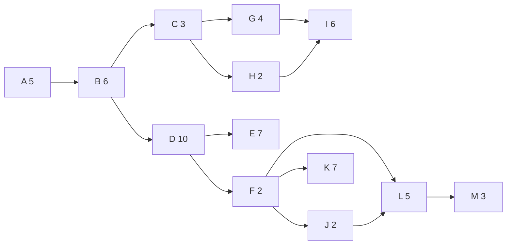
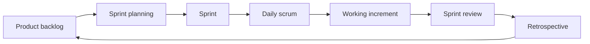

# 2016-17 Foundations of Software Engineering Markscheme

Source:
- Based on the questions supplied from the 2016-17 ISE / FSE paper.
- Related paper file: [2016-17 - Foundations of Software Engineering Exam Paper.pdf](<2016-17 - Foundations of Software Engineering Exam Paper.pdf>)

## Section A: Software Quality `[20 marks]`

## Question 1 `[4 marks]`

Name and briefly describe the four fundamental activities common to all software engineering processes.

Award 1 mark for each correctly named and briefly described activity.

- Specification: defining what the system should do and the constraints it must satisfy.
- Development: designing and implementing/producing the software system.
- Validation: checking that the system satisfies requirements and is what the customer/user wants.
- Evolution: changing the software after delivery in response to faults, new requirements, or changed environments.

Do not give full marks for names only unless the descriptions are clearly implied.

## Question 2 `[3 marks]`

Identify 3 techniques for validating requirements.

Award 1 mark for each valid technique.

Accept any three:
- Requirements reviews/inspections with stakeholders.
- Prototyping to check understanding with users/clients.
- Test-case derivation: checking whether requirements can be tested.
- Consistency checks to find contradictions.
- Feasibility checks for technical, cost, time, legal, or organisational realism.
- Traceability checks from stakeholders to requirements and forward to design/tests.
- Stakeholder walkthroughs or validation meetings.

## Question 3 `[6 marks]`

Prototypes are designed to fulfil one of three roles. Identify the three possible roles and give an example of how each would be used.

Award up to 2 marks for each role:
- 1 mark for identifying/describing the role.
- 1 mark for a suitable software engineering example.

Expected roles:

1. Requirements elicitation/exploration:
   - Used to discover or clarify what users need.
   - Example: a paper UI mockup shown to users so they can explain missing functions or confusing workflows.

2. Design/specification validation:
   - Used to check whether a proposed design or interaction will satisfy requirements before full implementation.
   - Example: a clickable high-fidelity prototype used in a review to confirm the planned navigation and acceptance criteria.

3. Technical feasibility/risk reduction:
   - Used to test whether a technical approach, integration, platform, or performance target is realistic.
   - Example: a small prototype that connects to an external API to check authentication, response time, or deployment feasibility.

Accept equivalent lecture wording such as exploratory, throwaway/evaluation, or evolutionary/communication prototypes if the answer clearly gives three distinct roles and examples.

## Question 4 `[3 marks]`

Briefly describe three ways that paired programming can increase software quality.

Award 1 mark for each valid point.

Accept any three:
- Provides continuous review while code is written.
- Finds defects or design problems earlier.
- Shares knowledge across the team.
- Reduces dependence on one developer.
- Helps junior developers learn from more experienced developers.
- Improves consistency with coding standards.
- Encourages discussion of design choices.
- Improves maintainability because more than one person understands the code.

## Question 5 `[4 marks]`

Describe Continuous Integration and how it can be used with automated testing to prepare a product for release.

Award up to 4 marks:

- 1 mark: defines CI as frequent integration of developers' work into a shared mainline/repository.
- 1 mark: mentions automated builds/checks triggered by commits or regular integration.
- 1 mark: explains automated testing, such as unit/integration/regression tests, runs to detect faults early.
- 1 mark: links CI/testing to release readiness: quick feedback, fewer integration surprises, evidence that the current build works, safer release candidate, or deployment to test environments.

Strong answer:
Continuous Integration means developers frequently commit and integrate changes into the shared codebase. Each integration can trigger an automated build and automated test suite. Failures are reported quickly, so defects are fixed before they accumulate. Passing builds and tests provide evidence that the current version is stable enough for release testing or deployment preparation.

## Section B: Project Management and Tracking `[15 marks]`

Project facts:
- Team size: 6 developers.
- Each task estimate is for a pair of developers working together.
- Therefore, at most 3 tasks can run at the same time.

Task data:

| Task | Duration | Dependencies | Milestone |
| ---- | -------- | ------------ | --------- |
| A | 5 days | none | |
| B | 6 days | A | M1 |
| C | 3 days | B | |
| D | 10 days | B | |
| E | 7 days | D | |
| F | 2 days | D | |
| G | 4 days | C | M2 |
| H | 2 days | C | |
| I | 6 days | G, H | M3 |
| J | 2 days | F | |
| K | 7 days | F | |
| L | 5 days | F, J | |
| M | 3 days | L | M4 |

Earliest-start schedule:

| Task | Earliest start | Earliest finish |
| ---- | -------------- | --------------- |
| A | 0 | 5 |
| B | 5 | 11 |
| C | 11 | 14 |
| D | 11 | 21 |
| G | 14 | 18 |
| H | 14 | 16 |
| I | 18 | 24 |
| E | 21 | 28 |
| F | 21 | 23 |
| J | 23 | 25 |
| K | 23 | 30 |
| L | 25 | 30 |
| M | 30 | 33 |

## Question 6 i `[3 marks]`

Draw a Gantt chart showing task dependencies and durations from start to end.

Award up to 3 marks:

- 1 mark: correct task order/dependencies.
- 1 mark: correct durations and start/finish positions.
- 1 mark: clear Gantt-style presentation showing overlaps and project end.

Reference Gantt:

```mermaid
gantt
    title 2016-17 Question 6 Gantt Chart
    dateFormat  X
    axisFormat  Day %s
    section Main path
    A :a, 0, 5
    B :b, after a, 6
    D :d, after b, 10
    F :f, after d, 2
    J :j, after f, 2
    L :l, after j, 5
    M :m, after l, 3
    section C branch
    C :c, after b, 3
    G :g, after c, 4
    H :h, after c, 2
    I :i, after g, 6
    section Other D branch
    E :e, after d, 7
    K :k, after f, 7
```

Dependency graph:

## Question 6 ii `[1 mark]`

How long is the critical path?

Award 1 mark:
- Critical path length is `33 days`.

Critical path:
- `A-B-D-F-J-L-M`

Calculation:
- `5 + 6 + 10 + 2 + 2 + 5 + 3 = 33 days`

## Question 6 iii `[1 mark]`

On which day will you have a staffing problem?

Award 1 mark:
- Day `23`, specifically the interval from day `23` to day `24`.

Explanation:
- At day 23, the earliest schedule has `E`, `I`, `J`, and `K` running at the same time.
- Each task needs a pair of developers.
- Four simultaneous tasks need 8 developers / 4 pairs, but only 6 developers / 3 pairs are available.

## Question 6 iv `[2 marks]`

Which task should be delayed to remove the staffing problem without extending the critical path? Explain why.

Award up to 2 marks:

- 1 mark: choose a suitable non-critical task, preferably `K`.
- 1 mark: explain that delaying it by 1 day removes the day-23 overload and does not extend the critical path/project finish.

Expected answer:
- Delay task `K` by 1 day, from `23-30` to `24-31`.
- This removes the overlap of four simultaneous tasks on day 23.
- `K` is not on the critical path and has no successor controlling the project finish.
- The critical path `A-B-D-F-J-L-M` still ends on day `33`.

Alternative:
- Delaying another non-critical task may receive credit if the answer shows the staffing conflict is removed and the project duration remains 33 days.

## Section B: Risk Questions

## Question 7 i `[2 marks]`

Explain the difference between risks for the software and risks for the project.

Award up to 2 marks:

- Software risks affect the product/system itself, such as security, dependability, privacy, correctness, performance, safety, or platform compatibility.
- Project risks affect successful delivery, such as delays, cost overruns, staff absence, loss of expertise, poor communication, unclear requirements, or dependency problems.

## Question 7 ii `[2 marks]`

Describe how identified software risks affect Requirements Engineering.

Award up to 2 marks:

Accept:
- Software risks create or change requirements, especially non-functional requirements.
- Risks may create "shall not" requirements, such as the system shall not expose private data.
- Risks must be analysed early so they can influence specification, design, and testing.
- Requirements should include validation/test criteria for risky behaviours.
- Risk analysis improves traceability between requirements, design decisions, and tests.

Full-mark example:
If data-protection risk is identified, requirements engineering must capture security/privacy requirements such as authentication, authorization, encryption, audit logs, and access restrictions, and those requirements must be validated and tested.

## Question 8 `[4 marks]`

Your company is small and an expert tester has a long-term illness that may affect future work. Describe two strategies for handling this risk and identify which type of strategy each is.

Award up to 2 marks for each strategy:
- 1 mark for a suitable strategy.
- 1 mark for correctly identifying its type.

Good answers:

1. Mitigation/minimisation:
   - Cross-train another developer/tester, pair the expert with another team member, document testing procedures, and share knowledge.
   - This reduces the impact/probability of the expert being unavailable causing failure.

2. Contingency:
   - Arrange backup support, such as a contractor, external testing company, temporary hire, or reserve schedule plan if the expert becomes unavailable.
   - This is a fallback plan if the risk happens.

Alternative valid answer:
- Avoidance: change the project plan so the expert is not the only person responsible for critical testing work, or avoid scheduling them as a single point of failure on critical-path tasks.

Full marks require two distinct strategies and correct labels.

## Section C: Agile Methodologies `[15 marks]`

## Question 9 `[3 marks]`

Explain why, in the 90s, Formal Software Engineering approaches were losing favour.

Award 1 mark for each clear reason, up to 3.

Accept:
- Requirements often changed during development, making rigid upfront plans difficult.
- Full formal specification before implementation was often unrealistic.
- Users/customers may not know what they need until they see working software.
- Heavy documentation and process could slow delivery.
- Late changes in formal/waterfall-style processes were expensive.
- Market and technology change required faster feedback and adaptation.
- Separate specialist phases could reduce communication and delay feedback.

High-scoring answers should not claim formal methods are always bad; they were losing favour where flexibility and rapid feedback mattered.

## Question 10 `[4 marks]`

Identify and briefly describe the four original values of the Agile Manifesto.

Award 1 mark for each value, with brief description.

- Individuals and interactions over processes and tools: communication and collaboration matter more than blindly following tools/processes.
- Working software over comprehensive documentation: usable software is the main evidence of progress, though documentation still has value.
- Customer collaboration over contract negotiation: ongoing customer/user involvement is preferred to relying only on fixed contracts.
- Responding to change over following a plan: teams should adapt when requirements or circumstances change.

## Question 11 `[4 marks]`

Describe, with a diagram, how the Scrum technique works.

Award up to 4 marks:

- 1 mark: product backlog/product owner/prioritised work.
- 1 mark: sprint planning and fixed-length sprint.
- 1 mark: daily scrum/team work leading to a working increment.
- 1 mark: sprint review/retrospective and feedback into the next backlog/sprint.

Reference diagram:

Good answer:
Scrum keeps a prioritised product backlog. In sprint planning, the team selects backlog items for a fixed-length sprint. During the sprint, the development team works and uses daily scrums to coordinate progress and blockers. At the end, the team demonstrates a working increment in a sprint review and reflects in a retrospective before reprioritising the backlog for the next sprint.

## Question 12 `[4 marks]`

Describe how the four original values of the Agile Manifesto are represented in Scrum.

Award 1 mark for each value mapped clearly to Scrum.

- Individuals and interactions: daily scrums, team communication, self-organising team, Scrum Master removing blockers.
- Working software: each sprint aims to produce a working increment.
- Customer collaboration: product owner represents customer/stakeholder priorities; sprint reviews gather feedback.
- Responding to change: backlog can be reprioritised between sprints based on feedback or changing needs.

Full marks require explicit links between each Agile Manifesto value and Scrum practice.

## General Marking Notes

- Award credit for equivalent wording if the software engineering meaning is correct.
- For short-answer questions, one clear point usually earns one mark.
- For scenario/risk questions, reward answers that apply the idea to the given company/tester scenario.
- For Question 6, accept any valid Gantt/schedule that preserves dependencies and correctly identifies the critical path and staffing issue.
