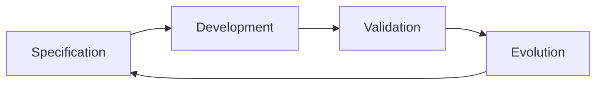

# 01 - Introduction to Software Engineering

Source: [01 - Introduction to Software Engineering.pdf](<../Lecture Slides/01 - Introduction to Software Engineering.pdf>)

## Core Summary

This lecture introduces software engineering as a systematic, disciplined approach to building, operating, maintaining, and evolving software. The key idea is that real software is more than code: it includes documentation, configuration, deployment, updates, tests, platform support, and long-term maintenance.

Software engineering is needed because individual programming habits do not scale cleanly to team projects, large systems, changing requirements, real users, reliability expectations, deadlines, and cost constraints.

## Key Concepts

- Real software includes source/compiled code, documentation, configuration, installation, upgrade, deployment, servers, databases, integrations, and version history.
- Common failure causes include poor requirements, communication breakdown, insufficient testing, cost overruns, delays, and cancellation.
- Cutting corners usually moves cost into quality, maintenance, or future rework.
- Software engineering has four fundamental activities: specification, development, validation, and evolution.
- Different process models organise these activities differently.

## Process Models

Waterfall:
- staged process;
- requirements, design, implementation/unit testing, integration/system testing, operation/maintenance;
- works best when requirements are stable and documentation/sign-off matter.

V-model:
- pairs development stages with related testing/validation stages;
- useful for showing traceability from requirements/design to tests.

Iterative/agile:
- overlaps specification, development, and validation;
- useful when requirements change or user feedback matters.

Spiral:
- iterative and risk-driven;
- each cycle includes planning, risk analysis, development/prototyping, validation, and review.

## Diagram To Remember

## Exam Angles

- Define software engineering clearly: systematic development, operation, maintenance, and evolution.
- Explain why software engineering is needed for large/team/long-lived software.
- Be able to list and explain the four fundamental activities.
- Compare waterfall and agile using stability, feedback, documentation, and change.
