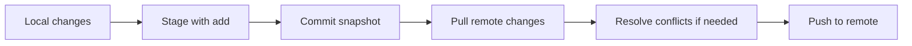

# 02 - Git Ready for Teamwork

Source: [02 - Git Ready for Teamwork.pdf](<../Lecture Slides/02 - Git Ready for Teamwork.pdf>)

## Core Summary

This lecture explains Git as a version-control tool for teamwork. Git protects code by recording history, allowing old versions to be recovered, coordinating multiple developers, and warning when remote work has changed.

## Key Concepts

- Clone: copy a repository locally.
- Status: inspect the working directory.
- Diff: see changes between versions.
- Add: stage changes.
- Commit: save a snapshot.
- Push: upload commits to the remote repository.
- Pull: bring remote changes into the local repository.
- Tag: give a friendly name to a commit, often for releases.
- `.gitignore`: prevent generated, local, build, executable, or machine-specific files from being tracked.

## Teamwork Principles

- Pull before push because another developer may have changed the shared project.
- Resolve conflicts thoughtfully rather than overwriting work.
- Commit meaningful snapshots with understandable messages.
- Use tags for important versions or releases.
- Keep generated files and local machine files out of version control.

## Diagram To Remember

## Exam Angles

- Explain why Git matters for software engineering: history, teamwork, recovery, traceability, and safer collaboration.
- Explain why pulling before pushing matters.
- Explain what `.gitignore` and tags are for.
- Connect Git to release management, CI, and code review.
