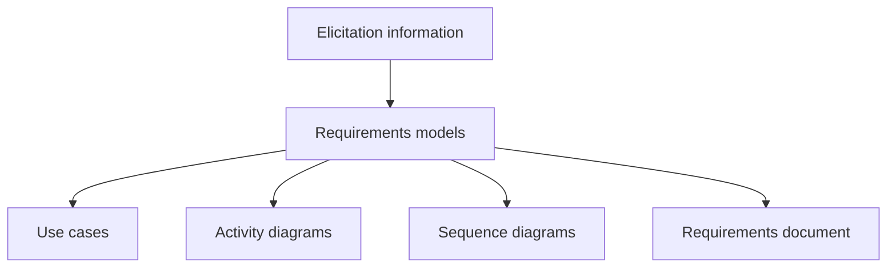

# 05 - Requirements Modelling

Source: [05 - Requirements Modelling.pdf](<../Lecture Slides/05 - Requirements Modelling.pdf>)

## Core Summary

This lecture explains how models help organise, communicate, and validate requirements. Requirements modelling turns raw elicitation information into diagrams and structured descriptions that stakeholders and developers can reason about.

## Why Model Requirements?

Models help:
- communicate stakeholder needs;
- organise complex workflows;
- expose ambiguity;
- reveal missing cases;
- validate behaviour before implementation;
- support traceability to design and tests.

## UML at Different Levels

UML can be used both for requirements and for design/specification.

Requirements-level UML:
- use case diagrams for user goals;
- activity diagrams for workflows;
- sequence diagrams for user/system interaction.

Design/specification-level UML:
- class diagrams for software structure;
- sequence diagrams for object/service interactions;
- activity diagrams for internal logic.

## Diagram To Remember

## Exam Angles

- Explain why models are useful: communication, organisation, validation, and ambiguity reduction.
- Explain how the same UML type can be used at requirements and design levels.
- Use "abstraction level" as the key phrase: user tasks vs internal technical structure.
