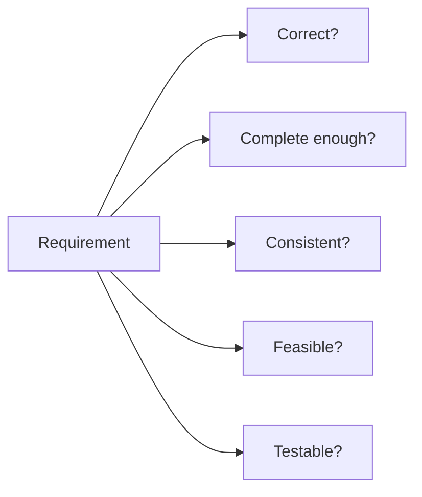

# 06 - Requirements Validation

Source: [06 - Requirements Validation.pdf](<../Lecture Slides/06 - Requirements Validation.pdf>)

## Core Summary

This lecture covers checking requirements before later engineering work depends on them. Requirements validation ensures requirements are correct, complete enough, consistent, feasible, and testable.

## Requirements Document Audiences

Requirements documents may be used by:
- clients and users;
- project managers;
- developers and designers;
- testers;
- maintenance teams;
- QA staff.

Because many groups use the document, it must be readable and structured.

## Validation Checks

Validation techniques:
- reviews/inspections;
- stakeholder walkthroughs;
- consistency checks;
- feasibility checks;
- deriving test cases;
- prototyping;
- traceability checks.

## Why It Matters

Finding requirements errors late can require changes to design, code, tests, documentation, contracts, and acceptance expectations.

## Exam Angles

- Define requirements validation as checking requirements before implementation depends on them.
- List validation techniques.
- Explain why validation is cheaper early.
- Connect validation to testing and acceptance criteria.
