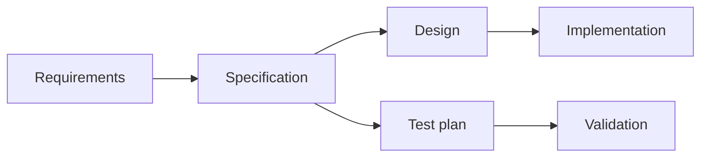

# 07 - Specifications

Source: [07 - Specifications.pdf](<../Lecture Slides/07 - Specifications.pdf>)

## Core Summary

This lecture explains specifications as the bridge between requirements and implementation. Specifications describe how the system will satisfy requirements in enough detail to guide design, coding, and testing.

## Key Ideas

- Requirements say what is needed.
- Specifications say how the system will be built or behave in detail.
- Specifications support implementation, test planning, integration, and maintenance.
- Specifications should be clear, reviewed, readable, and useful to their audience.

## Team Practice

Good teams:
- agree what good work looks like;
- plan integration;
- avoid simply splitting work without coordination;
- review work together;
- connect specifications to requirements and tests.

## Diagram To Remember

## Exam Angles

- Compare requirements and specifications clearly.
- Explain why specifications must be readable and reviewed.
- Explain how specifications support testing.
- Mention UML/specification models when asked about detailed design.
