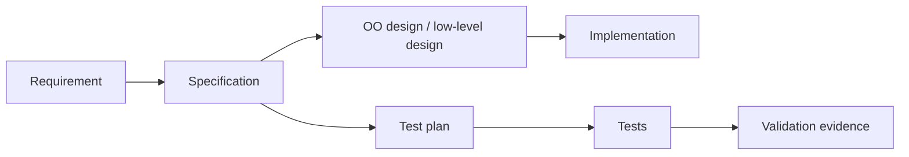

# 09 - Object-Oriented Design and Test Planning

Source: [09 - Object-Oriented Design and Test Planning.pdf](<../Lecture Slides/09 - Object-Oriented Design and Test Planning.pdf>)

## Core Summary

This lecture connects low-level design and test planning. The specification phase should produce designs detailed enough to guide developers and tests detailed enough to check expected behaviour.

## Key Ideas

- Low-level designs are outputs of the specification phase.
- Object-oriented design can use classes, objects, responsibilities, relationships, and interactions.
- Test planning belongs before implementation because expected behaviour should be testable.
- Design models and tests should trace back to requirements/specifications.

## Design and Testing Link

## Exam Angles

- Explain why test planning is part of specification/design, not just an afterthought.
- Explain that designs should guide implementation.
- Connect UML/design models to testable behaviour.
- Mention traceability from requirements to tests.
