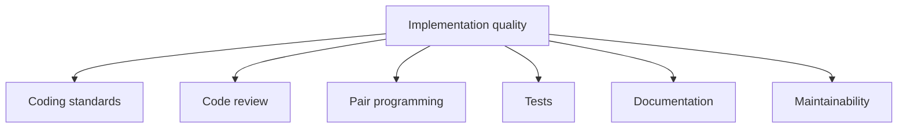

# 10 - Implementation

Source: [10 - Implementation.pdf](<../Lecture Slides/10 - Implementation.pdf>)

## Core Summary

This lecture focuses on implementation quality. Software development is social: code is written for other developers, reviewers, testers, maintainers, and future change, not only for the compiler.

## Key Ideas

- Well-implemented code is easier to maintain.
- Implementation quality depends on conventions, standards, structure, review, tests, and communication.
- Coding standards help teams work consistently.
- Pair programming and review improve quality and spread knowledge.

## Implementation Quality Factors

## Coding Conventions

Conventions improve:
- readability;
- consistency;
- maintainability;
- code review;
- team integration;
- onboarding.

## Exam Angles

- If asked why conventions matter, say maintainability, readability, consistency, fewer mistakes, easier review, and easier team integration.
- If asked about pair programming, mention continuous review, knowledge sharing, mentoring, and reduced key-person risk.
- Anchor implementation answers in maintainability.
