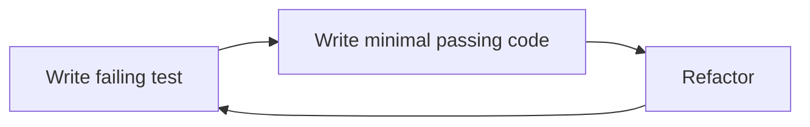

# 11 - Unit Tests and TDD

Source: [11 - Unit Tests and TDD.pdf](<../Lecture Slides/11 - Unit Tests and TDD.pdf>)

## Core Summary

This lecture covers unit testing, debugging, and test-driven development. Testing detects that a problem exists; debugging locates and removes its cause.

## Debugging

Good debugging:
- reproduce the fault;
- inspect state;
- form a hypothesis;
- test one explanation at a time;
- use breakpoints, stepping, logs, variable inspection, trace tables, and systematic narrowing.

Bad debugging:
- random code changes;
- changing several things at once;
- failing to understand the cause;
- fixing symptoms only.

## TDD Cycle

## TDD Benefits

- encourages testable design;
- provides regression tests;
- supports refactoring;
- gives fast feedback;
- documents expected behaviour.

## Exam Angles

- Distinguish testing from debugging.
- Explain the TDD cycle.
- Mention TDD benefits and pitfalls.
- Connect TDD to agile, CI, maintainability, and unit testing.
