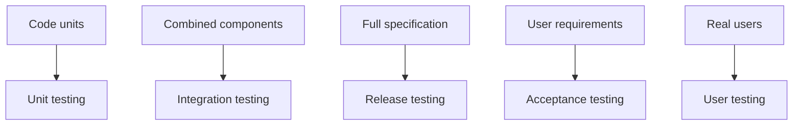

# 12 - Release and Acceptance Testing

Source: [12 - Release and Acceptance Testing.pdf](<../Lecture Slides/12 - Release and Acceptance Testing.pdf>)

## Core Summary

This lecture explains different testing stages and especially the distinction between release testing and acceptance testing.

## Testing Stages

- Unit testing: tests individual functions/classes/components.
- Integration testing: tests combinations and interactions between components.
- Release testing: tests the complete system against the functional and non-functional specification.
- Acceptance testing: checks whether the client/customer accepts the system against user requirements and expectations.
- User testing: real users try the system in realistic conditions.

## Diagram To Remember

## Release vs Acceptance

Release testing:
- internal;
- full-system;
- specification-based;
- checks readiness to show/release.

Acceptance testing:
- client/customer-facing;
- requirement/business-expectation based;
- supports sign-off, payment, or contract completion.

## Exam Angles

- Be able to define each testing stage.
- Compare release and acceptance testing directly.
- Explain that acceptance failures may indicate wrong requirements, not just bad code.
