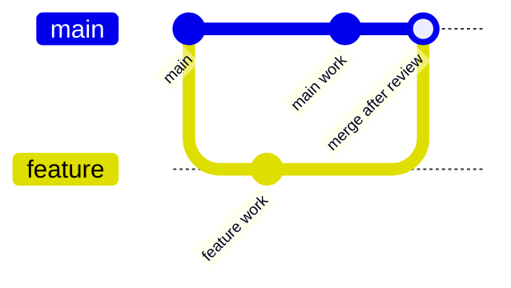

# 13 - Advanced Version Control

Source: [13 - Advanced Version Control.pdf](<../Lecture Slides/13 - Advanced Version Control.pdf>)

## Core Summary

This lecture develops Git beyond basic commit/push/pull by focusing on branches, feature branches, release branches, merging, stashing, and team workflows.

## Key Concepts

- Branch: isolated line of work.
- Feature branch: branch for a specific feature or bug fix.
- Release branch: branch used to stabilise a deployable version.
- Merge: combine work from one branch into another.
- Stash: temporarily store uncommitted work when switching tasks.
- Merge request/code review: review work before accepting it.

## Branching Diagram

## Why It Matters

Advanced version control supports:
- safer parallel work;
- code review;
- traceability;
- release management;
- reduced risk to main code;
- coordination in teams.

## Exam Angles

- Explain branches and feature branches.
- Explain stashing.
- Connect branching to code review, release branches, CI, and team coordination.
