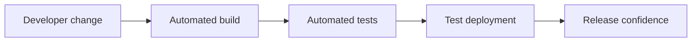

# 14 - Configuration and Deployment

Source: [14 - Configuration and Deployment.pdf](<../Lecture Slides/14 - Configuration and Deployment.pdf>)

## Core Summary

This lecture covers release management, configuration management, deployment, continuous integration, and the relationship between release, acceptance, and user testing.

## Release and Acceptance

- Release testing proves to the team that the product is ready to release/show.
- Acceptance testing is client acceptance, but acceptance should ideally be gained throughout development.
- User testing such as alpha/beta release can reveal future changes and start evolution.

## Release Management

Release management prepares periodic releases and updates. It can include:
- release testing;
- versioning/tags;
- release branches;
- deployment preparation;
- rollback planning;
- communication with users.

## Configuration Management

Configuration management controls:
- build settings;
- dependencies;
- platform-specific settings;
- environment assumptions;
- release versions;
- repeatable builds.

## Continuous Integration

## Exam Angles

- Explain how CI helps deployment: automated tests, builds, configuration scripts, and target-environment checks.
- Explain how configuration management supports multiple platforms.
- Compare release, acceptance, and user testing.
