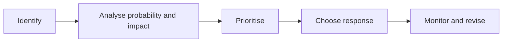

# 18 - Risk Management

Source: [18 - Risk Management.pdf](<../Lecture Slides/18 - Risk Management.pdf>)

## Core Summary

This lecture distinguishes software risks from project risks and introduces risk strategies: avoidance, mitigation/minimisation, and contingency/handling.

## Software vs Project Risks

Software risks affect the product:
- security;
- dependability;
- data protection;
- safety;
- correctness;
- platform compatibility;
- privacy.

Project risks affect delivery:
- staff absence;
- cost overruns;
- delays;
- unclear requirements;
- loss of expertise;
- dependency problems;
- poor communication.

## Risk Process

## Risk Strategies

Avoid:
- change the plan to remove the risk.

Mitigate/minimise:
- reduce probability or impact.

Contingency/handling:
- prepare a backup plan if the risk happens.

## Software Risks and Requirements

Software risks can create:
- functional requirements;
- non-functional requirements;
- "shall not" requirements;
- design constraints;
- test cases;
- traceability needs.

## Exam Angles

- Distinguish software and project risks.
- Give avoid/mitigate/contingency examples tied to the scenario.
- Explain how software risks affect requirements, specifications, and tests.
