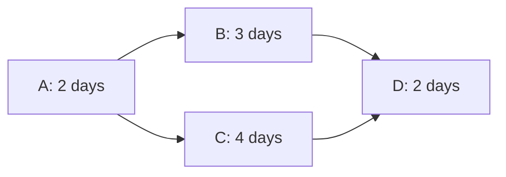

# 19 - Agile Planning and Project Management

Source: [19 - Agile Planning and Project Management.pdf](<../Lecture Slides/19 - Agile Planning and Project Management.pdf>)

## Core Summary

This lecture covers project planning, work breakdown, scheduling, milestones, deliverables, risk monitoring, PERT, critical path, Gantt charts, and staff allocation.

## Project Planning Contents

A project plan can include:
- introduction;
- project organisation;
- risk analysis;
- hardware/software needs;
- work breakdown;
- schedule;
- monitoring and revision plans.

Planning involves:
- defining schedule;
- identifying risks and constraints;
- defining milestones and deliverables;
- doing the work;
- monitoring progress;
- mitigating risks;
- replanning when needed.

## Planning Tools

PERT:
- shows tasks and dependencies.

Critical Path Method:
- identifies the dependency chain that determines project duration.

Gantt chart:
- adds time to tasks and dependencies.

Staff allocation:
- checks whether enough people are available for overlapping tasks.

## Example

Critical path:
- `A-C-D = 2 + 4 + 2 = 8 days`.
- `A-B-D = 2 + 3 + 2 = 7 days`.
- Therefore `B` has 1 day of slack.

## Exam Method

1. List tasks, durations, dependencies, and staff needs.
2. Find earliest start and finish for each task.
3. Identify the longest dependency chain.
4. State the critical path and project duration.
5. Check overlapping tasks for staffing conflicts.
6. Move non-critical tasks within slack if needed.

## Exam Angles

- Be able to find the critical path.
- Be able to identify slack.
- Be able to spot a staffing conflict.
- Explain why delaying a critical-path task delays the whole project.
