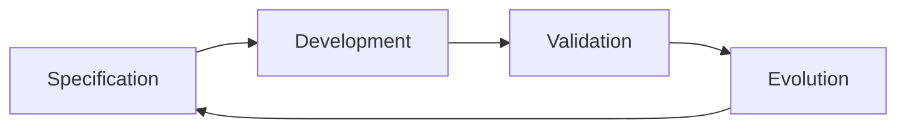
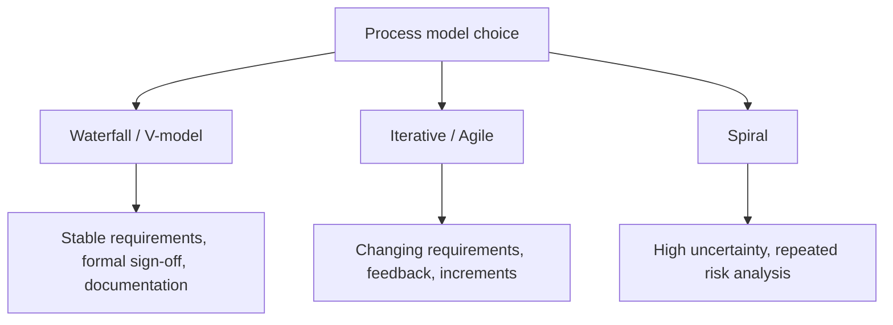
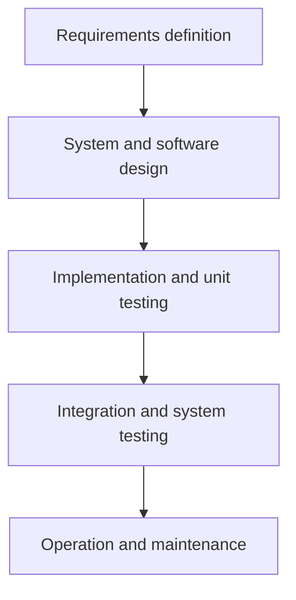
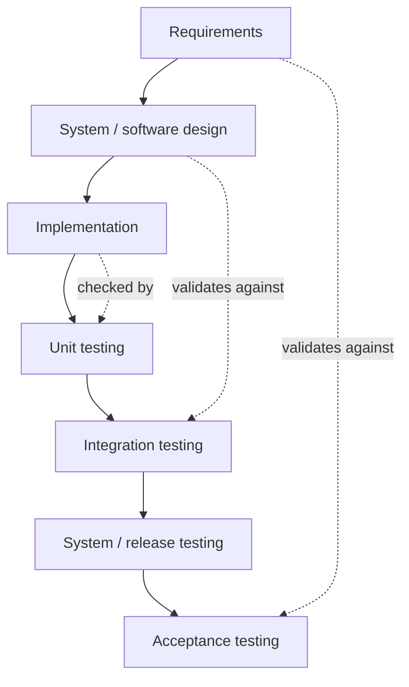
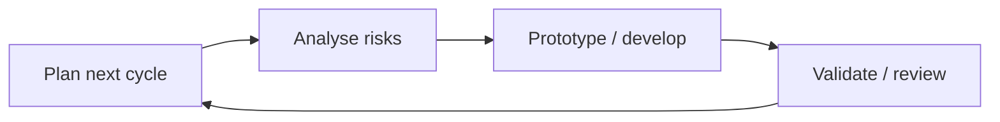

# Software Engineering Foundations

## What Software Engineering Is

Software engineering is the systematic, disciplined, and organised approach to developing, operating, maintaining, and evolving software. [L01 p27](<../Lecture Slides/01 - Introduction to Software Engineering.pdf#page=27>) [L01 p56](<../Lecture Slides/01 - Introduction to Software Engineering.pdf#page=56>)

It is not just "writing code". Real software usually includes:
- source code and compiled code;
- documentation for users, developers, testers, and maintainers;
- configuration files and platform-specific settings;
- build, installation, upgrade, release, and deployment mechanisms;
- servers, databases, APIs, external services, and integrations;
- version history, branches, tags, and release artefacts;
- tests, test data, and test environments;
- long-term support for users, developers, platforms, and changing requirements. [L01 p17](<../Lecture Slides/01 - Introduction to Software Engineering.pdf#page=17>) [L01 p21](<../Lecture Slides/01 - Introduction to Software Engineering.pdf#page=21>) [L01 p26](<../Lecture Slides/01 - Introduction to Software Engineering.pdf#page=26>)

The key idea is scale: the habits that work for one person writing a small program do not automatically work for teams building long-lived software for real users. [L01 p15](<../Lecture Slides/01 - Introduction to Software Engineering.pdf#page=15>) [L01 p22](<../Lecture Slides/01 - Introduction to Software Engineering.pdf#page=22>) [L01 p34](<../Lecture Slides/01 - Introduction to Software Engineering.pdf#page=34>)

## Why Software Engineering Exists

Software engineering exists because software projects fail for reasons that pure programming skill cannot solve alone:
- requirements are wrong, incomplete, ambiguous, or misunderstood;
- users and clients are not sufficiently involved;
- communication breaks down between stakeholders, developers, testers, and managers;
- testing is too weak or too late;
- change is handled informally, causing uncontrolled scope creep;
- cost and schedule estimates are unrealistic;
- code is difficult to maintain because standards, documentation, reviews, and tests were skipped;
- deployment, platform compatibility, configuration, or release management is neglected. [L01 p37](<../Lecture Slides/01 - Introduction to Software Engineering.pdf#page=37>) [L03 p13](<../Lecture Slides/03 - Requirements Introduction.pdf#page=13>)

Common exam phrase:
Software engineering is needed because real software must be reliable, maintainable, usable, testable, and deliverable by teams under time, cost, quality, and stakeholder constraints.

## Software Project Trade-Offs

Projects are usually constrained by:
- cost;
- schedule;
- quality;
- scope/features;
- people and expertise;
- risk;
- maintainability;
- stakeholder expectations.

Cutting corners to reduce cost or hurry a project usually moves the cost elsewhere. For example, skipping requirements validation can create expensive rework; skipping testing can create release failures; skipping documentation can increase maintenance cost. [L01 p47](<../Lecture Slides/01 - Introduction to Software Engineering.pdf#page=47>)

## Four Fundamental Software Engineering Activities

These four activities appear in most process models, even if the order and overlap differ. [L01 p57](<../Lecture Slides/01 - Introduction to Software Engineering.pdf#page=57>) [L01 p58](<../Lecture Slides/01 - Introduction to Software Engineering.pdf#page=58>)

Use this as the basic lifecycle memory hook: define what is needed, build it, check it, then change it as new needs appear.

### Specification

Specification defines what the system should do and the constraints under which it must be developed and operated. It links requirements, stakeholder needs, system behaviour, non-functional constraints, and later test planning.

Typical outputs:
- requirements documents;
- functional and non-functional specifications;
- UML models;
- acceptance criteria;
- testable descriptions of expected behaviour.

### Development

Development produces the software. It includes design, implementation, integration, debugging, refactoring, code review, and preparation for release.

Good development is not just "make it work"; it should also produce code that is understandable, maintainable, testable, and suitable for future change.

### Validation

Validation checks whether the software is what the customer wants and whether it satisfies the requirements and specification. [L03 p4](<../Lecture Slides/03 - Requirements Introduction.pdf#page=4>)

Validation includes:
- requirements validation;
- design/specification reviews;
- unit, integration, release, acceptance, and user testing;
- stakeholder feedback;
- prototype evaluation.

### Evolution

Evolution changes software after delivery in response to new requirements, faults, platform changes, user feedback, laws, business changes, or environment changes. [L03 p4](<../Lecture Slides/03 - Requirements Introduction.pdf#page=4>)

Evolution is not an optional afterthought. In many systems it is the longest and most expensive part of the lifecycle. [L01 p65](<../Lecture Slides/01 - Introduction to Software Engineering.pdf#page=65>)

## Process Models

Process models describe how the main activities are organised. The right process depends on project risk, uncertainty, regulation, documentation needs, team structure, and expected change.

## Waterfall Model

The waterfall model is a staged, plan-based process:
1. requirements definition;
2. system and software design;
3. implementation and unit testing;
4. integration and system testing;
5. operation and maintenance. [L01 p59](<../Lecture Slides/01 - Introduction to Software Engineering.pdf#page=59>)

Strengths:
- clear phases;
- good documentation;
- easier management visibility;
- useful when requirements are stable;
- suitable where formal sign-off or regulation matters.

Weaknesses:
- assumes requirements can be known early;
- change can have expensive knock-on effects;
- users may not see working software until late;
- late discovery of wrong requirements can be very costly. [L01 p61](<../Lecture Slides/01 - Introduction to Software Engineering.pdf#page=61>)

## V-Model

The V-model is a staged process that explicitly pairs development phases with validation/testing phases. Requirements link to acceptance/system testing, design links to integration testing, and implementation links to unit testing.

Strengths:
- shows that testing should be planned against earlier artefacts;
- encourages traceability between requirements, design, and tests;
- useful for formal or safety-conscious projects.

Weaknesses:
- can still be rigid;
- still depends on early correctness of requirements;
- can make change expensive if late changes affect many earlier artefacts.

## Iterative and Agile Models

Iterative and agile models overlap specification, development, and validation through repeated increments or versions. [L01 p62](<../Lecture Slides/01 - Introduction to Software Engineering.pdf#page=62>)

They are useful when:
- requirements are uncertain or changing;
- user feedback is important;
- early working software is valuable;
- the product can be delivered incrementally;
- the team can work closely with users or a customer representative.

Risks:
- poor process visibility;
- weak documentation;
- confusion between "lightweight" and "no process";
- moving quickly without enough design or testing. [L01 p64](<../Lecture Slides/01 - Introduction to Software Engineering.pdf#page=64>)

## Spiral Model

The spiral model is an iterative, risk-driven process. Each cycle includes planning, risk analysis, prototyping/development, validation, review, and planning the next cycle. [L01 p63](<../Lecture Slides/01 - Introduction to Software Engineering.pdf#page=63>) [L16 p29](<../Lecture Slides/16 - Agile vs Traditional and Maintenance.pdf#page=29>)

It is especially useful when:
- risk needs repeated assessment;
- prototypes are needed to reduce uncertainty;
- requirements are not fully known;
- the system is large or complex.

## Choosing a Process

Plan-based methods fit when:
- requirements are stable;
- legal, safety, financial, or data-protection risk is high;
- formal documentation and sign-off are required;
- teams are large or separated by specialist roles;
- external regulation or standards apply. [L16 p94](<../Lecture Slides/16 - Agile vs Traditional and Maintenance.pdf#page=94>) [L16 p95](<../Lecture Slides/16 - Agile vs Traditional and Maintenance.pdf#page=95>) [L16 p96](<../Lecture Slides/16 - Agile vs Traditional and Maintenance.pdf#page=96>)

Agile/iterative methods fit when:
- requirements are unclear or likely to change;
- regular user/customer feedback is available;
- early incremental delivery is valuable;
- the team is small or integrated;
- the system can evolve through working increments. [L16 p94](<../Lecture Slides/16 - Agile vs Traditional and Maintenance.pdf#page=94>) [L16 p99](<../Lecture Slides/16 - Agile vs Traditional and Maintenance.pdf#page=99>)

Strong scenario answers often use a hybrid: formal requirements, security, risk, and testing for high-risk parts; agile prototypes, user stories, and increments where uncertainty and feedback matter.

## Exam Angles

- If asked "what is software engineering?", define it as systematic development, operation, maintenance, and evolution of software, not just coding.
- If asked why it matters, mention scale, teams, requirements, quality, testing, delivery, maintenance, cost, and risk.
- If asked for four activities, write specification, development, validation, evolution, with one sentence each.
- If asked to compare waterfall and agile, contrast staged upfront planning with iterative feedback and changing requirements.
- If asked to choose a method, use scenario facts: risk, regulation, user access, uncertainty, team size, documentation need, and expected change.
