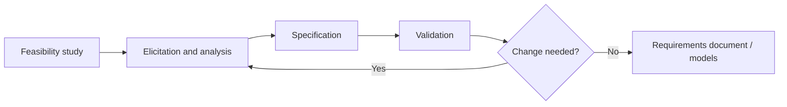
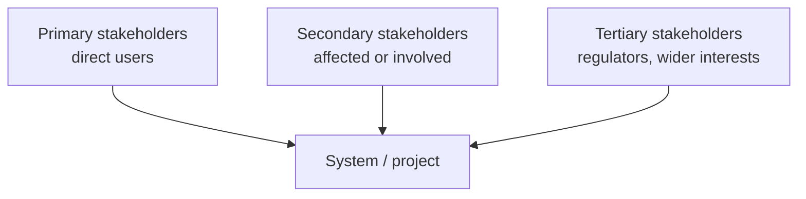
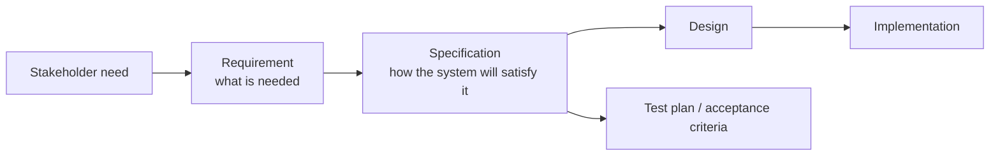
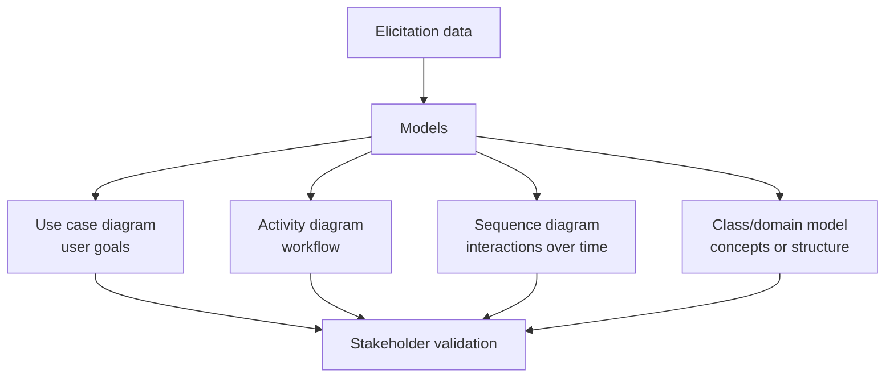
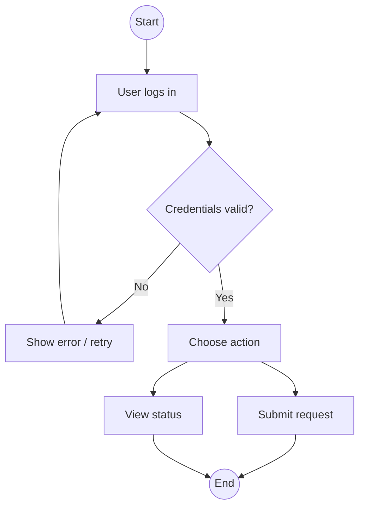
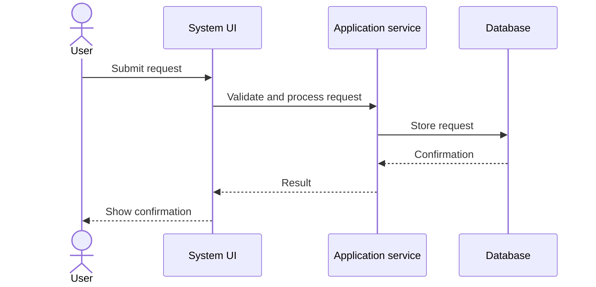
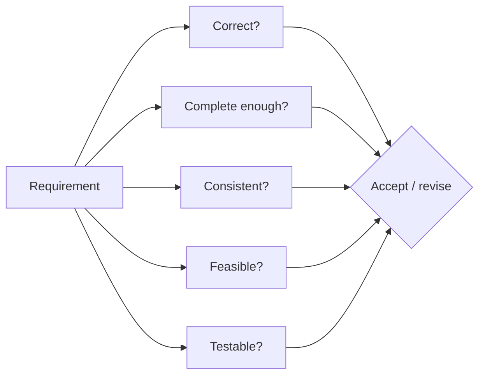

# Requirements and Specifications

## Why Requirements Matter

Requirements are the foundation for the rest of the software engineering process. They shape design, implementation, testing, acceptance, planning, risk management, quality, and later maintenance. [L03 p27](<../Lecture Slides/03 - Requirements Introduction.pdf#page=27>)

Bad requirements are strongly linked to:
- over-budget projects;
- late rework;
- project cancellation;
- unhappy clients;
- systems that technically work but solve the wrong problem;
- missing non-functional constraints such as security, performance, accessibility, reliability, or usability. [L03 p10](<../Lecture Slides/03 - Requirements Introduction.pdf#page=10>) [L03 p13](<../Lecture Slides/03 - Requirements Introduction.pdf#page=13>) [RR-REQ-RISK p1](<../Required Reading Notes/01 - Required Reading Findings.md>)

Incomplete requirements and lack of user involvement are major causes of project failure. [L03 p14](<../Lecture Slides/03 - Requirements Introduction.pdf#page=14>)

The earlier a requirements defect is found, the cheaper it is to fix. A requirement error found in maintenance may require changes to requirements, specification, architecture, code, tests, documentation, and acceptance expectations. [L03 p17](<../Lecture Slides/03 - Requirements Introduction.pdf#page=17>)

## Requirements Engineering

Requirements engineering is the process of discovering, analysing, documenting, and validating what stakeholders need from a system. [L03 p27](<../Lecture Slides/03 - Requirements Introduction.pdf#page=27>)

Typical requirements engineering process:
1. Feasibility study: is the system technically, economically, legally, and organisationally realistic?
2. Elicitation and analysis: gather needs from stakeholders, existing systems, market context, and problem analysis.
3. Specification: document requirements clearly enough to guide development and testing.
4. Validation: check requirements are correct, consistent, complete enough, feasible, and testable. [L03 p32](<../Lecture Slides/03 - Requirements Introduction.pdf#page=32>)

Possible outputs:
- feasibility report;
- stakeholder list;
- personas;
- use cases;
- system models;
- user requirements;
- system requirements;
- requirements document;
- validation findings. [L03 p32](<../Lecture Slides/03 - Requirements Introduction.pdf#page=32>)

## Sources of Requirements

Requirements can come from:
- project briefs;
- clients and customers;
- end users;
- administrators and support staff;
- existing systems;
- competitor/product analysis;
- market segments;
- platform rules;
- tenders and contractual documents;
- laws, standards, accessibility expectations, and security needs. [L03 p29](<../Lecture Slides/03 - Requirements Introduction.pdf#page=29>) [L03 p30](<../Lecture Slides/03 - Requirements Introduction.pdf#page=30>)

Do not treat the first brief as complete. Briefs often contain vague goals, hidden assumptions, missing users, and unclear non-functional requirements.

## Stakeholders

A stakeholder is anyone affected by the system or able to affect it.

Stakeholder categories:
- Primary stakeholders directly use the system.
- Secondary stakeholders do not directly use it but are affected or involved.
- Tertiary stakeholders have wider interest, influence, regulation, or indirect impact. [L03 p37](<../Lecture Slides/03 - Requirements Introduction.pdf#page=37>)

Stakeholder analysis should consider:
- who the stakeholder is;
- what they need from the system;
- how important or influential they are;
- how the system affects them;
- what information should be elicited from them;
- whether they represent real users or only management assumptions. [L03 p38](<../Lecture Slides/03 - Requirements Introduction.pdf#page=38>)

## Requirements Elicitation

Requirements elicitation is the process of discovering stakeholder needs.

Common techniques:
- interviews and conversations;
- workshops;
- observation of existing work;
- questionnaires or surveys;
- analysis of existing systems;
- competitor/product analysis;
- personas;
- use cases;
- prototypes;
- document analysis.

Good elicitation looks for both explicit requests and hidden needs. Users may describe current workflows rather than underlying goals; clients may describe desired features rather than the problem; managers may overlook accessibility, usability, or operational constraints.

## Personas

Personas are fictional but evidence-based representations of user groups. They should capture:
- user goals;
- motivations;
- expectations;
- knowledge and skill level;
- context of use;
- frustrations;
- accessibility or usability needs;
- differences between stakeholder groups. [L03 p40](<../Lecture Slides/03 - Requirements Introduction.pdf#page=40>)

Personas help teams avoid designing only for themselves. They support prioritisation by making it clearer which users are affected by which requirements. [L03 p43](<../Lecture Slides/03 - Requirements Introduction.pdf#page=43>)

## Use Cases

Use cases describe user goals and interactions with the system. Use case diagrams represent:
- actors;
- system boundary;
- use cases/tasks;
- relationships between tasks. [L03 p47](<../Lecture Slides/03 - Requirements Introduction.pdf#page=47>)

Use cases can include:
- main success scenario;
- alternative paths;
- optional extensions;
- mandatory related tasks;
- preconditions;
- postconditions;
- exceptional cases. [L03 p49](<../Lecture Slides/03 - Requirements Introduction.pdf#page=49>)

Use cases are useful because they keep attention on what users are trying to accomplish, not only on internal technical structure.

## Requirements vs Specifications

Requirements describe what users, clients, and stakeholders need the system to do. [L04 p3](<../Lecture Slides/04 - Requirements Gathering.pdf#page=3>)

Specifications describe how the system will be built or structured in enough detail to satisfy the requirements. [L07 p4](<../Lecture Slides/07 - Specifications.pdf#page=4>)

Example:
- Requirement: A student must be able to submit coursework online before the deadline.
- Specification: The system shall provide an authenticated submission form, store uploaded files with timestamps, reject submissions after the deadline unless an extension flag exists, and show confirmation to the student.

Do not blur the distinction:
- Requirements are problem/user/client-facing.
- Specifications are solution/system/developer-facing.

## Functional and Non-Functional Requirements

Functional requirements describe what the system does. [L04 p3](<../Lecture Slides/04 - Requirements Gathering.pdf#page=3>)

Examples:
- users can register an account;
- staff can approve requests;
- the system sends a confirmation email;
- administrators can export reports.

Non-functional requirements describe qualities, constraints, or limits on how the system behaves. [L04 p3](<../Lecture Slides/04 - Requirements Gathering.pdf#page=3>)

Examples:
- performance: pages load within 2 seconds under normal use;
- security: sensitive data is encrypted and access-controlled;
- reliability: the service is available 99.9% of the time;
- usability: users can complete a core task without training;
- accessibility: the interface supports screen readers and keyboard navigation;
- maintainability: code follows agreed conventions and is covered by tests;
- portability: the system runs on specified browsers or platforms.

Missing non-functional requirements can be severe because they often affect architecture, testing, cost, and acceptance. [RR-REQ-RISK p2](<../Required Reading Notes/01 - Required Reading Findings.md>)

## Requirements Modelling

Requirements modelling turns elicitation information into structured representations that can be discussed, checked, and documented. [L05 p4](<../Lecture Slides/05 - Requirements Modelling.pdf#page=4>)

Models help:
- communicate with stakeholders;
- organise complex needs;
- expose ambiguity or missing cases;
- validate workflows before implementation;
- create traceability to design and tests. [L05 p7](<../Lecture Slides/05 - Requirements Modelling.pdf#page=7>)

UML can be used at both requirements level and design/specification level. [L05 p7](<../Lecture Slides/05 - Requirements Modelling.pdf#page=7>)

Requirements-level UML:
- use case diagram for user goals;
- activity diagram for business process or workflow;
- sequence diagram for interaction between user and system.

Specification/design-level UML:
- sequence diagram for objects/services/method calls;
- class diagram for software classes and relationships;
- activity diagram for internal workflow or algorithm.

## Activity Diagrams

Activity diagrams model workflows, use-case logic, business processes, decisions, and parallel activities. [RR-ACT](<../Required Reading Notes/01 - Required Reading Findings.md>)

Common notation:
- start node;
- end node;
- activities/actions;
- flows/arrows;
- decision and merge points;
- guards/conditions;
- fork and join for parallel work;
- notes;
- swimlanes/partitions to show responsibility.

Swimlanes are useful in requirements work because stakeholders can validate who performs each activity.

## Sequence Diagrams

Sequence diagrams model ordered interactions over time. Messages are read from top to bottom. [RR-SEQ](<../Required Reading Notes/01 - Required Reading Findings.md>)

At requirements level, a sequence diagram can show how a user, system, and external service interact in a scenario.

At design level, a sequence diagram can show calls between objects, controllers, services, databases, or APIs.

This is a common exam point: the same diagram type can support different phases at different abstraction levels.

## Requirements Documents

Requirements documents are read by:
- clients and users;
- project managers;
- developers;
- designers;
- testers;
- maintainers;
- quality assurance staff. [L06 p4](<../Lecture Slides/06 - Requirements Validation.pdf#page=4>)

A good requirements document should:
- be understandable to its audience;
- separate user-level needs from technical detail;
- include functional and non-functional requirements;
- make requirements testable where possible;
- avoid ambiguity and contradictions;
- support traceability to design, code, and tests.

## Requirements Validation

Requirements validation checks whether requirements are correct, consistent, complete enough, feasible, and testable before later work depends on them. [L06 p4](<../Lecture Slides/06 - Requirements Validation.pdf#page=4>)

Validation techniques:
- stakeholder reviews;
- inspections;
- consistency checks;
- feasibility checks;
- test-case derivation;
- prototyping;
- traceability checks;
- checking against personas/use cases;
- checking for missing non-functional requirements.

Important distinction:
- Verification asks whether the product was built according to specification.
- Validation asks whether the right product is being built for users/stakeholders.

## Requirements Change Management

Requirements change management is the controlled process for proposing, assessing, approving, rejecting, implementing, and tracing changes to requirements.

It matters because requirement changes can affect:
- cost;
- schedule;
- risk;
- specifications;
- architecture;
- code;
- tests;
- documentation;
- acceptance criteria;
- contracts and stakeholder expectations.

Without change management, the project can suffer uncontrolled scope creep, inconsistent documentation, broken traceability, and unexpected technical debt.

## Required Reading Emphasis

The required readings strengthen these themes:
- requirements are often harder and riskier than coding;
- missing user classes, functional requirements, quality attributes, or performance attributes can force expensive rework;
- non-functional requirements deserve explicit attention;
- requirements inspections are valuable because late defects are expensive;
- a project can execute well and still fail if the requirements do not represent real user needs. [RR-REQ-SO](<../Required Reading Notes/01 - Required Reading Findings.md>) [RR-FAIL](<../Required Reading Notes/01 - Required Reading Findings.md>) [RR-REQ-RISK](<../Required Reading Notes/01 - Required Reading Findings.md>)

## Exam Angles

- If asked why requirements matter, mention failure, rework, cost, testing, quality, planning, and user acceptance.
- If asked about elicitation, mention stakeholders, interviews/discussions, personas, use cases, observation, prototypes, and existing systems.
- If asked functional vs non-functional, give one clear definition and one concrete example for each.
- If asked requirements vs specifications, state "what is needed" vs "how it will be built/behave in detail".
- If asked about UML in requirements/specification, explain abstraction level: user workflows vs internal design.
- If a scenario includes accessibility, sensitive data, public users, or performance demands, treat these as non-functional requirements.
