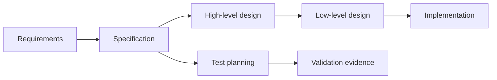
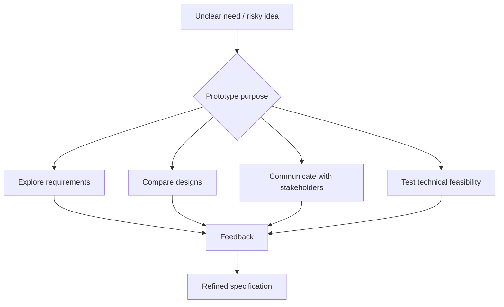
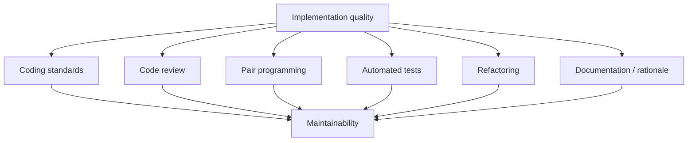
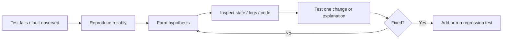

# Design, Prototyping, and Implementation

## Specifications and Design

Specifications come after requirements and describe how the system will satisfy those requirements. [L07 p1](<../Lecture Slides/07 - Specifications.pdf#page=1>) [L08 p4](<../Lecture Slides/08 - Prototyping.pdf#page=4>)

Specifications should guide:
- architecture;
- data structures;
- user-interface behaviour;
- APIs and component interfaces;
- class/object design;
- workflow and interaction design;
- test planning;
- implementation decisions.

A specification is only useful if the people who need it can understand it. The required reading on specifications emphasises readable writing, concrete examples, stories, visuals, screenshots/mockups, whitespace, and review. [RR-SPEC](<../Required Reading Notes/01 - Required Reading Findings.md>)

## Specification Quality

Good specifications are:
- clear;
- readable;
- specific enough to guide development;
- testable;
- reviewed;
- connected to requirements;
- understandable by their intended audience;
- structured from big picture to detail.

Weak specifications are:
- vague;
- overly dense;
- full of unexplained jargon;
- disconnected from user needs;
- too technical for stakeholder validation;
- too informal for implementation and testing.

## Team Design Practice

Good teams do not simply split work and hope it integrates later. They:
- agree design conventions;
- decide what "good work" means;
- review each other's work;
- define interfaces before implementation;
- integrate regularly;
- document decisions;
- keep traceability between requirements, design, code, and tests. [L07 p8](<../Lecture Slides/07 - Specifications.pdf#page=8>)

Low-level designs are final outputs of the specification phase and guide implementation. [L09 p7](<../Lecture Slides/09 - Object-Oriented Design and Test Planning.pdf#page=7>)

Test planning belongs in the specification phase because expected behaviour must be testable before implementation starts. [L09 p7](<../Lecture Slides/09 - Object-Oriented Design and Test Planning.pdf#page=7>)

## UML in Design

UML can support both requirements and design. At design level it usually becomes more technical.

Examples:
- a requirements-level sequence diagram might show `Student -> Submission System -> Email Service`;
- a design-level sequence diagram might show `SubmissionController -> FileStore -> SubmissionRepository -> NotificationService`;
- a requirements-level class diagram might show domain concepts;
- a design-level class diagram might show classes, methods, fields, inheritance, associations, and dependencies.

Exam point:
If asked how the same UML diagram type can support requirements and specifications, say the notation may be the same but the abstraction level changes.

## Prototyping

Prototypes are high-level designs or partial implementations used to explore ideas, communicate with stakeholders, and develop specifications. [L08 p7](<../Lecture Slides/08 - Prototyping.pdf#page=7>)

They are useful when:
- requirements are unclear;
- users struggle to explain what they need abstractly;
- the team needs feedback before committing to implementation;
- the user interface or workflow is important;
- the project has high uncertainty;
- alternative designs need comparing.

## Prototype Types

Exploratory prototype:
Used to discover requirements, understand user needs, or compare possible approaches.

Throwaway prototype:
Built to learn something, then discarded. It should not become production code.

Evolutionary prototype:
Gradually developed into the final system. It needs stronger engineering discipline because prototype decisions may become permanent.

Communication prototype:
Used to help stakeholders discuss, approve, reject, or refine ideas.

Technical prototype:
Used to test feasibility, architecture, performance, APIs, deployment, or risky technologies.

## Low- and High-Fidelity Prototypes

Low-fidelity prototypes:
- cheap;
- quick;
- rough;
- easy to change;
- useful early;
- examples include sketches, paper prototypes, wireframes, simple mockups.

High-fidelity prototypes:
- realistic;
- more detailed;
- often interactive;
- useful for detailed feedback;
- more expensive to build;
- can be mistaken for finished software.

The key difference is not only visual polish; it is cost, realism, changeability, and what kind of feedback the prototype is meant to produce. [L08 p7](<../Lecture Slides/08 - Prototyping.pdf#page=7>)

## Prototype Benefits

Prototypes can:
- reveal missing requirements;
- expose misunderstood requirements;
- support user involvement;
- clarify UI/workflow expectations;
- reduce risk;
- improve communication;
- help validate specifications;
- make acceptance criteria more concrete;
- support agile incremental development.

## Prototype Risks

Prototype risks:
- too much effort is spent on a temporary artefact;
- stakeholders mistake it for the finished product;
- prototype code becomes production code without proper quality;
- documentation is skipped because "the prototype shows it";
- the wrong stakeholders approve it;
- feedback focuses on visual detail rather than core requirements;
- high-fidelity prototypes create unrealistic expectations.

To manage these risks, state the purpose, fidelity, audience, and disposal/evolution plan before building.

## Implementation Quality

Implementation quality is about producing code that works and remains understandable, changeable, testable, reviewable, and maintainable. [L10 p8](<../Lecture Slides/10 - Implementation.pdf#page=8>)

Software development is social. Developers write code for other developers, testers, maintainers, reviewers, users, and future versions of themselves. [L10 p8](<../Lecture Slides/10 - Implementation.pdf#page=8>)

Implementation quality depends on:
- coding standards;
- naming conventions;
- readable structure;
- comments where useful;
- tests;
- code review;
- pair programming;
- refactoring;
- documentation;
- version control;
- traceability.

## Coding Standards and Conventions

Coding standards improve:
- readability;
- consistency;
- maintainability;
- review quality;
- onboarding;
- integration of work from multiple developers;
- defect detection;
- long-term evolution. [L10 p8](<../Lecture Slides/10 - Implementation.pdf#page=8>) [L15 p12](<../Lecture Slides/15 - Coursework Intro and Evolution Maintenance.pdf#page=12>)

The code-conventions required reading treats convention adherence as a proxy for maintainability. Developers may understand conventions are important but abandon them under deadline pressure. [RR-CODE](<../Required Reading Notes/01 - Required Reading Findings.md>)

Exam answer:
Coding conventions are not just cosmetic; they make code easier for other developers to understand, review, modify, test, and maintain.

## Code Review

Code reviews check code before it becomes accepted work.

They can find:
- logic errors;
- unclear naming;
- inconsistent conventions;
- missing tests;
- poor structure;
- security issues;
- maintainability problems;
- mismatch between implementation and requirements.

Reviews are cheaper than finding problems after release or during maintenance. They also spread knowledge and reduce key-person risk. [RR-MAINT](<../Required Reading Notes/01 - Required Reading Findings.md>)

## Pair Programming

Pair programming has two developers working together on the same task, commonly with one driving and one reviewing/navigating.

Benefits:
- continuous review;
- knowledge sharing;
- mentoring;
- fewer misunderstandings;
- faster detection of design issues;
- better consistency with team standards;
- reduced dependence on one developer;
- stronger maintainability. [L10 p8](<../Lecture Slides/10 - Implementation.pdf#page=8>) [L16 p68](<../Lecture Slides/16 - Agile vs Traditional and Maintenance.pdf#page=68>)

Risks/limitations:
- can feel slower at first;
- needs communication skill;
- not every task needs two people;
- pairing poorly matched developers can reduce benefit.

Exam scenario use:
Pair programming is a good mitigation for staff absence or key-person dependency because more than one person understands the code.

## Debugging

Testing establishes that a bug exists; debugging locates and removes its cause. [L11 p8](<../Lecture Slides/11 - Unit Tests and TDD.pdf#page=8>)

Debugging strategies:
- reproduce the fault reliably;
- inspect error messages;
- use breakpoints;
- step through execution;
- inspect variables;
- use trace tables;
- add logging/print statements;
- form hypotheses;
- test one hypothesis at a time;
- narrow the search area;
- compare expected and actual state;
- check recent changes. [L11 p11](<../Lecture Slides/11 - Unit Tests and TDD.pdf#page=11>) [L11 p12](<../Lecture Slides/11 - Unit Tests and TDD.pdf#page=12>) [L11 p13](<../Lecture Slides/11 - Unit Tests and TDD.pdf#page=13>) [L11 p14](<../Lecture Slides/11 - Unit Tests and TDD.pdf#page=14>)

Bad debugging:
- random changes;
- changing several things at once;
- ignoring reproduction steps;
- failing to record what has been tried;
- fixing symptoms without understanding cause. [L11 p15](<../Lecture Slides/11 - Unit Tests and TDD.pdf#page=15>)

## Technical Debt and Maintainability

Technical debt is future cost created by shortcuts. It can come from:
- skipped tests;
- poor documentation;
- unclear comments;
- inconsistent conventions;
- ignored warnings;
- rushed design;
- lack of refactoring;
- unreviewed code;
- missing rationale for decisions. [RR-MAINT](<../Required Reading Notes/01 - Required Reading Findings.md>)

Maintainability means software is easy to:
- understand;
- change;
- test/check after change;
- fix;
- extend;
- adapt to new environments;
- hand over to new developers. [RR-MAINT](<../Required Reading Notes/01 - Required Reading Findings.md>)

## Traceability and Evidence

Good engineering evidence connects:
- issues/tickets;
- requirements;
- design notes;
- merge requests;
- code reviews;
- code comments;
- tests;
- documentation. [L15 p14](<../Lecture Slides/15 - Coursework Intro and Evolution Maintenance.pdf#page=14>) [L15 p15](<../Lecture Slides/15 - Coursework Intro and Evolution Maintenance.pdf#page=15>)

Traceability matters because it lets a team explain why something exists, who requested it, how it was implemented, and how it was tested.

Practical examples:
- a Jira/GitHub issue describes a requirement;
- a branch implements the issue;
- tests prove the expected behaviour;
- a merge request records review;
- documentation explains usage or rationale. [RR-IND](<../Required Reading Notes/01 - Required Reading Findings.md>)

## Exam Angles

- If asked about specifications, mention clarity, readability, testability, review, and connection to requirements.
- If asked about prototypes, cover purpose, fidelity, benefits, and risks.
- If asked low- vs high-fidelity, contrast speed/cost/changeability with realism/detail.
- If asked coding conventions, focus on maintainability, readability, consistency, review, and team integration.
- If asked pair programming, include continuous review, knowledge sharing, mentoring, and key-person risk reduction.
- If asked debugging, distinguish finding a bug from finding/removing its cause.
- If asked about implementation quality, anchor the answer in maintainability.
