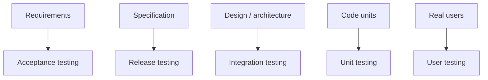
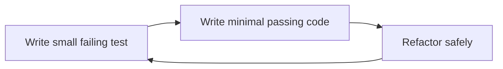
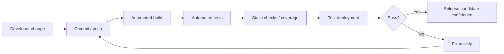
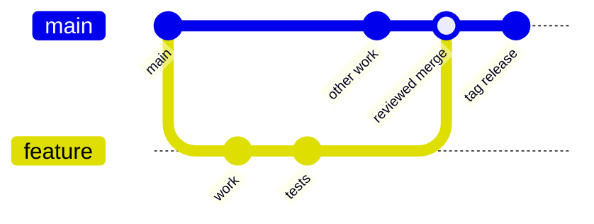

# Testing, CI, Deployment, and Version Control

## Why Testing Matters

Testing is part of validation: it helps check whether software behaves as expected and whether it is ready for release, acceptance, or use. Testing does not guarantee absence of defects, but it provides evidence about quality, correctness, and risk.

Testing is most effective when connected to:
- requirements;
- specifications;
- acceptance criteria;
- design decisions;
- risk analysis;
- code changes;
- maintenance/evolution.

Testing alone is not enough to create quality. It must be combined with good requirements, reviews, maintainable implementation, CI, release management, and QA.

## Development Testing

Development testing happens during implementation. It includes unit testing and integration testing. [L12 p10](<../Lecture Slides/12 - Release and Acceptance Testing.pdf#page=10>) [L12 p11](<../Lecture Slides/12 - Release and Acceptance Testing.pdf#page=11>)

It is usually performed by developers and aims to find faults early while the relevant code is still fresh and cheap to change.

## Unit Testing

Unit testing tests individual units of code, such as functions, methods, classes, or components. [L12 p7](<../Lecture Slides/12 - Release and Acceptance Testing.pdf#page=7>) [L12 p8](<../Lecture Slides/12 - Release and Acceptance Testing.pdf#page=8>)

Unit tests should usually be:
- small;
- repeatable;
- automated where possible;
- focused on one behaviour;
- fast enough to run frequently;
- linked to expected behaviour.

Benefits:
- finds bugs early;
- supports refactoring;
- documents expected behaviour;
- supports CI;
- helps developers debug confidently;
- gives maintainers regression protection.

Limitations:
- does not prove components work together;
- may miss user-level behaviour;
- weak tests can create false confidence;
- high coverage alone does not prove meaningful testing.

## Integration Testing

Integration testing tests combinations of units and the interactions between classes, modules, components, services, or systems. [L12 p7](<../Lecture Slides/12 - Release and Acceptance Testing.pdf#page=7>) [L12 p8](<../Lecture Slides/12 - Release and Acceptance Testing.pdf#page=8>)

It looks for issues such as:
- interface mismatches;
- incorrect data passed between components;
- timing/order problems;
- API misunderstandings;
- configuration issues;
- assumptions made by one component but not satisfied by another.

Integration testing is essential because units can pass individually but fail together.

## Release Testing

Release testing checks the complete system against the functional and non-functional specification before it is shown or released to the client. [L12 p13](<../Lecture Slides/12 - Release and Acceptance Testing.pdf#page=13>) [L14 p7](<../Lecture Slides/14 - Configuration and Deployment.pdf#page=7>)

Typical features:
- full-system testing;
- based on specification;
- often performed by testers independent from developers;
- checks readiness for release or presentation;
- includes functional and non-functional behaviours.

Release testing failures usually go back to development/testing work.

## Acceptance Testing

Acceptance testing checks whether the client/customer accepts that the system satisfies user requirements, business expectations, or contractual obligations. [L12 p13](<../Lecture Slides/12 - Release and Acceptance Testing.pdf#page=13>) [L14 p7](<../Lecture Slides/14 - Configuration and Deployment.pdf#page=7>)

Acceptance testing:
- is client/customer-facing;
- is based on user requirements and agreed expectations;
- supports sign-off, payment, or contract completion;
- can reveal that requirements/specifications were wrong, not just that code is buggy.

Important exam contrast:
- Release testing asks: "Is the complete system ready to release/show?"
- Acceptance testing asks: "Does the customer accept that this is the right system?"

## Acceptance Throughout the Process

Acceptance should not be treated only as a final event. [L14 p7](<../Lecture Slides/14 - Configuration and Deployment.pdf#page=7>)

Teams can gain acceptance throughout by:
- validating requirements early;
- using prototypes;
- agreeing acceptance criteria;
- reviewing specifications with stakeholders;
- involving users in sprint reviews;
- testing increments;
- checking usability/accessibility with real users.

This reduces the risk of finding late that the team built the wrong thing.

## User Testing

User testing involves real users using the software in realistic contexts. It can happen around alpha/beta release or after initial release, and it can begin the evolution phase by revealing new needs or defects. [L12 p13](<../Lecture Slides/12 - Release and Acceptance Testing.pdf#page=13>) [L14 p8](<../Lecture Slides/14 - Configuration and Deployment.pdf#page=8>)

User testing is especially important for:
- usability;
- accessibility;
- public-facing systems;
- systems with diverse user groups;
- workflows that developers may not understand.

Usability testing measures whether users can achieve goals effectively and easily, using evidence such as task success, errors, time taken, satisfaction, and observation. [RR-USE](<../Required Reading Notes/01 - Required Reading Findings.md>)

## Test-Driven Development

Test-driven development interweaves coding, unit testing, and design/refactoring. [RR-TDD](<../Required Reading Notes/01 - Required Reading Findings.md>)

The TDD cycle:
1. Write a small test for a desired behaviour.
2. Run it and see it fail.
3. Write the simplest code that makes the test pass.
4. Refactor while keeping tests passing.
5. Repeat.

Benefits:
- encourages testable design;
- builds a regression suite;
- can reduce later defects;
- supports refactoring;
- gives fast feedback;
- documents intended behaviour;
- fits agile and CI workflows.

Pitfalls:
- writing too many tests at once;
- not running tests often;
- writing coarse or trivial tests;
- omitting assertions;
- abandoning slow or unreliable test suites;
- partial team adoption;
- treating code coverage as proof of good testing.

Evidence of TDD can include tests committed with product code and meaningful coverage, but coverage alone does not prove TDD was done well. [RR-TDD](<../Required Reading Notes/01 - Required Reading Findings.md>)

## Regression Testing

Regression testing checks that existing behaviour still works after changes. It is especially important during maintenance, refactoring, bug fixes, and new feature work.

Regression tests support:
- confidence during evolution;
- safer refactoring;
- CI;
- detection of unintended side effects;
- long-term maintainability.

## Continuous Integration

Continuous integration means developers frequently integrate changes into a shared mainline, with automated checks to keep the product working. [L14 p9](<../Lecture Slides/14 - Configuration and Deployment.pdf#page=9>) [L16 p68](<../Lecture Slides/16 - Agile vs Traditional and Maintenance.pdf#page=68>)

A good CI process may include:
- frequent commits/pushes;
- automated builds;
- automated unit tests;
- automated integration tests;
- static checks or linting;
- code coverage reports;
- deployment to test environments;
- platform-specific builds;
- failure notifications;
- logs for traceability.

Benefits:
- detects integration problems early;
- reduces "it works on my machine" problems;
- supports safer release preparation;
- provides evidence that code has been tested;
- encourages small, regular changes;
- supports remote and agile teams. [RR-IND](<../Required Reading Notes/01 - Required Reading Findings.md>)

Exam phrase:
CI helps show software is ready for deployment by combining automated tests, repeatable builds, configuration scripts, and target-environment checks.

## Configuration Management

Configuration management controls versions, build settings, dependencies, environments, platform-specific settings, and release artefacts. [L14 p9](<../Lecture Slides/14 - Configuration and Deployment.pdf#page=9>)

It helps produce software for multiple platforms by:
- recording dependencies;
- managing build scripts;
- separating platform configurations;
- controlling release versions;
- making builds repeatable;
- supporting rollback or reproduction of previous releases.

Examples:
- separate build configurations for Windows/macOS/Linux;
- browser-specific compatibility settings;
- different database connection settings for test and production;
- environment variables;
- package/dependency versions.

## Release Management and Deployment

Release management prepares periodic releases and updates. [L14 p9](<../Lecture Slides/14 - Configuration and Deployment.pdf#page=9>)

It may involve:
- choosing release contents;
- release branches;
- tags/version numbers;
- release testing;
- build artefacts;
- deployment plans;
- rollback plans;
- user documentation;
- communicating changes to users;
- monitoring after release.

Deployment means delivering the software to its target environment, such as user machines, servers, cloud infrastructure, app stores, or test environments.

## Git and Version Control

Git supports team software engineering by storing project history, coordinating changes, supporting branches, and protecting against accidental overwrites. [L02 p9](<../Lecture Slides/02 - Git Ready for Teamwork.pdf#page=9>) [L02 p15](<../Lecture Slides/02 - Git Ready for Teamwork.pdf#page=15>) [L02 p21](<../Lecture Slides/02 - Git Ready for Teamwork.pdf#page=21>)

Core commands/concepts:
- clone: copy a repository locally;
- status: inspect working directory state;
- diff: inspect changes;
- add: stage changes;
- commit: record a snapshot;
- push: upload commits;
- pull: bring in remote changes;
- branch: isolate work;
- merge: combine branches;
- tag: name an important commit/release;
- stash: temporarily store uncommitted work;
- `.gitignore`: prevent local/build/generated files from being tracked. [L02 p26](<../Lecture Slides/02 - Git Ready for Teamwork.pdf#page=26>) [L02 p33](<../Lecture Slides/02 - Git Ready for Teamwork.pdf#page=33>) [L13 p5](<../Lecture Slides/13 - Advanced Version Control.pdf#page=5>) [L13 p15](<../Lecture Slides/13 - Advanced Version Control.pdf#page=15>)

## Pull Before Push

Pull before push matters because someone else may have changed the remote repository since your last update. [L02 p12](<../Lecture Slides/02 - Git Ready for Teamwork.pdf#page=12>) [L02 p29](<../Lecture Slides/02 - Git Ready for Teamwork.pdf#page=29>)

It helps:
- avoid overwriting others' work;
- detect conflicts;
- integrate remote changes;
- keep local and remote histories aligned.

## Branching Workflows

Branches let developers work independently before merging into shared code. [L13 p5](<../Lecture Slides/13 - Advanced Version Control.pdf#page=5>) [L13 p10](<../Lecture Slides/13 - Advanced Version Control.pdf#page=10>)

Feature branches:
- isolate feature or bug-fix work;
- support review before merge;
- map well to issues/tickets;
- reduce risk to the main branch. [L13 p6](<../Lecture Slides/13 - Advanced Version Control.pdf#page=6>) [RR-IND](<../Required Reading Notes/01 - Required Reading Findings.md>)

Release branches:
- stabilise deployable versions;
- allow bug fixes for a release without blocking main development;
- support release testing and version tagging.

Merge requests/code reviews:
- support review;
- record decisions;
- improve traceability;
- catch defects before acceptance.

## Version Control as Engineering Evidence

Version control supports:
- traceability;
- code review;
- teamwork;
- accountability;
- recovery;
- release management;
- safer change management.

In applied answers, mention practical evidence such as issues/tickets, branches, merge requests, CI logs, tests, and tags.

## Exam Angles

- If asked testing stages, define unit, integration, release, acceptance, and user testing.
- If asked release vs acceptance, contrast internal specification-based readiness with client/user acceptance.
- If asked why acceptance should happen throughout, mention early requirements validation, prototypes, reviews, and incremental feedback.
- If asked TDD, state the red-green-refactor loop and benefits/pitfalls.
- If asked CI, mention frequent integration plus automated builds/tests.
- If asked configuration management, mention repeatable builds, dependencies, platform settings, and release versions.
- If asked Git for teamwork, mention history, pull before push, branches, conflicts, tags, reviews, and traceability.
