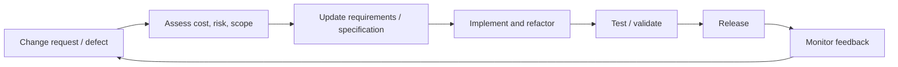
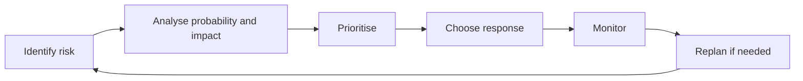
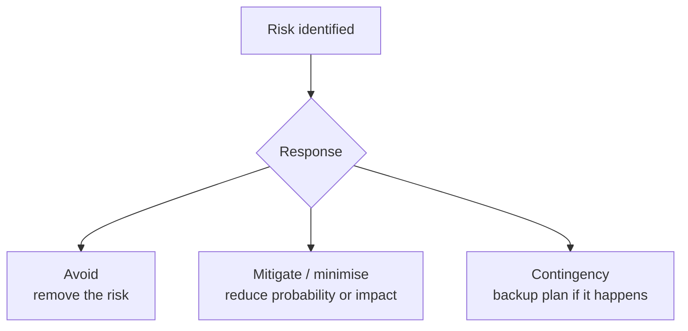
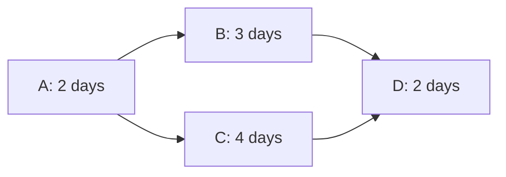

# Maintenance, Quality, and Risk

## Maintenance and Evolution

Maintenance/evolution happens after delivery and is driven by change. [L16 p6](<../Lecture Slides/16 - Agile vs Traditional and Maintenance.pdf#page=6>)

Maintenance includes:
- correcting undiscovered errors;
- adapting to new platforms, environments, APIs, laws, or business rules;
- enhancing services as new requirements appear;
- improving performance, usability, maintainability, or security. [L16 p8](<../Lecture Slides/16 - Agile vs Traditional and Maintenance.pdf#page=8>)

Change is inevitable because clients, business strategies, technologies, laws, platforms, competitors, and user needs change over time. [L16 p9](<../Lecture Slides/16 - Agile vs Traditional and Maintenance.pdf#page=9>)

Maintenance is often the longest lifecycle phase and can be the most expensive stage in which to make changes. [L16 p8](<../Lecture Slides/16 - Agile vs Traditional and Maintenance.pdf#page=8>) [L16 p11](<../Lecture Slides/16 - Agile vs Traditional and Maintenance.pdf#page=11>)

## Types of Maintenance

Corrective maintenance:
Fixing faults/bugs discovered after delivery.

Adaptive maintenance:
Changing software for a new environment, platform, API, operating system, browser, law, or external system.

Perfective maintenance:
Adding or improving functionality, performance, usability, maintainability, or other qualities.

These are common exam categories. [L16 p8](<../Lecture Slides/16 - Agile vs Traditional and Maintenance.pdf#page=8>) [L16 p39](<../Lecture Slides/16 - Agile vs Traditional and Maintenance.pdf#page=39>)

## Why Maintenance Is Expensive

Maintenance is expensive because a change can affect:
- requirements;
- specifications;
- architecture;
- code structure;
- interfaces;
- tests;
- documentation;
- deployment;
- acceptance criteria;
- contracts and stakeholder expectations. [L16 p13](<../Lecture Slides/16 - Agile vs Traditional and Maintenance.pdf#page=13>)

Late changes are more costly because earlier decisions have already been built into code, tests, documentation, and user expectations.

## Requirements Change Management

Change should begin with requirements change management, not arbitrary code edits. [L16 p13](<../Lecture Slides/16 - Agile vs Traditional and Maintenance.pdf#page=13>) [L16 p14](<../Lecture Slides/16 - Agile vs Traditional and Maintenance.pdf#page=14>)

Change management should:
- record the proposed change;
- identify affected requirements;
- assess cost, schedule, risk, quality, and contractual impact;
- approve/reject/prioritise the change;
- update specifications and tests;
- preserve traceability;
- communicate the decision to stakeholders.

Without change management, projects can suffer scope creep, inconsistent documentation, broken tests, architectural decay, and stakeholder disagreement.

## Emergency Changes

Emergency changes may be needed for urgent faults, security issues, or business-critical problems.

Good practice:
- fix the urgent problem;
- document what was done;
- review the fix later;
- redesign/refactor properly if needed;
- update tests and documentation. [L16 p16](<../Lecture Slides/16 - Agile vs Traditional and Maintenance.pdf#page=16>)

## Refactoring

Refactoring improves code structure without intentionally changing external behaviour. It is preventative maintenance because it slows degradation through repeated change. [L16 p18](<../Lecture Slides/16 - Agile vs Traditional and Maintenance.pdf#page=18>)

Benefits:
- improves readability;
- reduces duplication;
- makes future changes easier;
- improves testability;
- reduces technical debt;
- supports long-term evolution.

Refactoring is safest when supported by automated regression tests.

## Technical Debt and Maintainability

Technical debt is future cost created by shortcuts such as:
- skipping tests;
- ignoring warnings;
- weak documentation;
- poor naming;
- missing comments/rationale;
- no refactoring;
- rushed architecture;
- inconsistent conventions;
- unreviewed code. [RR-MAINT](<../Required Reading Notes/01 - Required Reading Findings.md>)

Maintainable software is easy to:
- understand;
- change;
- verify after change;
- fix;
- extend;
- adapt;
- hand over to new developers. [RR-MAINT](<../Required Reading Notes/01 - Required Reading Findings.md>)

Maintainability practices:
- readable code;
- conventions;
- code reviews;
- pair programming;
- documentation;
- refactoring;
- automated tests;
- automated builds;
- CI;
- version control.

## Evolution as a Repeated Engineering Loop

Evolution is best treated as another software engineering loop:
1. identify change/new requirement;
2. assess risk/cost/scope;
3. update requirements/specifications;
4. design and implement;
5. validate/test;
6. release;
7. monitor and repeat. [L16 p35](<../Lecture Slides/16 - Agile vs Traditional and Maintenance.pdf#page=35>) [L16 p39](<../Lecture Slides/16 - Agile vs Traditional and Maintenance.pdf#page=39>)

## Software Quality

Software quality is not just a release or acceptance testing stage. Quality should be planned and managed throughout the process. [L17 p5](<../Lecture Slides/17 - Software Quality.pdf#page=5>)

Quality can include:
- correctness;
- reliability;
- security;
- usability;
- accessibility;
- maintainability;
- performance;
- testability;
- compatibility;
- documentation quality;
- process quality.

## Quality Is Pervasive

Quality activities can happen throughout:
- requirements validation;
- specification inspections;
- prototype reviews;
- coding standards;
- code review;
- pair programming;
- test planning;
- TDD;
- release testing;
- acceptance testing;
- documentation standards;
- traceability;
- process improvement.

Testing is important, but testing at the end cannot easily repair bad requirements, weak design, or unmaintainable implementation. [L17 p5](<../Lecture Slides/17 - Software Quality.pdf#page=5>)

## Quality Assurance

QA teams plan for quality, define standards/procedures, and check that projects conform to company standards. [L17 p7](<../Lecture Slides/17 - Software Quality.pdf#page=7>)

QA teams should ideally be separate from development teams and report above the project manager so quality concerns are not swallowed by short-term delivery pressure. [L17 p7](<../Lecture Slides/17 - Software Quality.pdf#page=7>)

QA can include:
- planning for quality;
- defining standards;
- checking for quality;
- identifying inspection points;
- identifying useful measures;
- improving testing protocols;
- documenting lessons learned. [L17 p8](<../Lecture Slides/17 - Software Quality.pdf#page=8>) [L17 p14](<../Lecture Slides/17 - Software Quality.pdf#page=14>)

## Quality Plan

A quality plan defines what high-quality software means for a particular project. [L17 p12](<../Lecture Slides/17 - Software Quality.pdf#page=12>)

It can include:
- product introduction;
- product plans;
- process description;
- quality goals;
- standards;
- testing approach;
- review/inspection points;
- risks and risk management. [L17 p12](<../Lecture Slides/17 - Software Quality.pdf#page=12>)

## Four Quality Management Activities

Quality planning:
Define goals, standards, procedures, responsibilities, and measures.

Quality assurance:
Define and maintain processes that should lead to quality.

Quality control/checking:
Inspect outputs and check compliance with standards.

Process improvement/measurement:
Use defects, reviews, and metrics to improve future projects.

## Risk Management

A risk is a possible future problem that could harm the product or project.

Risk management involves:
- identifying risks;
- analysing probability and impact;
- prioritising risks;
- choosing responses;
- monitoring risks during the project;
- updating plans when risks change. [L18 p8](<../Lecture Slides/18 - Risk Management.pdf#page=8>)

Risk management is not finished after planning. Risks must be monitored.

## Software Risks vs Project Risks

Software risks affect the product itself. [L18 p8](<../Lecture Slides/18 - Risk Management.pdf#page=8>)

Examples:
- security weakness;
- dependability failure;
- data protection issue;
- unsafe behaviour;
- platform incompatibility;
- incorrect output;
- poor performance;
- privacy breach.

Project risks affect delivery and project success. [L18 p8](<../Lecture Slides/18 - Risk Management.pdf#page=8>)

Examples:
- staff illness;
- loss of key developer;
- schedule delay;
- cost overrun;
- unclear requirements;
- dependency delay;
- tool or technology risk;
- poor communication.

## How Software Risks Affect Requirements

Software risks can create:
- functional requirements;
- non-functional requirements;
- "shall not" requirements;
- extra validation needs;
- security/design constraints;
- test cases;
- traceability requirements. [L18 p8](<../Lecture Slides/18 - Risk Management.pdf#page=8>)

Example:
If the system stores medical records, software risk creates requirements around authentication, authorization, encryption, audit logs, privacy, availability, and testing.

## Risk Strategies

Avoidance:
Change the plan so the risk is removed or no longer relevant.

Example:
Avoid using an unfamiliar technology if the project cannot absorb the learning risk.

Mitigation/minimisation:
Reduce the probability or impact of the risk.

Example:
Use pair programming and documentation to reduce the impact of a key developer being absent.

Contingency/handling:
Prepare a backup plan if the risk happens.

Example:
Have a backup developer, contractor, alternate supplier, rollback plan, or adjusted schedule ready.

## Authorization and Security Risk

The required reading adds a security angle: authentication proves identity, while authorization decides what an authenticated user may do. [RR-MS](<../Required Reading Notes/01 - Required Reading Findings.md>)

Authorization should not rely only on the user interface. UI checks can hide buttons, but business-tier and data-tier checks may still be needed.

For sensitive-data scenarios, mention:
- authentication;
- authorization;
- roles;
- least privilege;
- business-rule checks;
- data-tier protection;
- security testing;
- non-functional security requirements.

## Project Planning Mechanics

A Gantt chart shows tasks over time, including ordering, overlap, milestones, and staff allocation. [L19 p11](<../Lecture Slides/19 - Agile Planning and Project Management.pdf#page=11>)

A dependency means one task cannot start until another task is complete. [L19 p11](<../Lecture Slides/19 - Agile Planning and Project Management.pdf#page=11>)

The critical path is the dependency chain that determines the shortest possible project duration. Delaying a critical-path task delays the whole project. [L19 p11](<../Lecture Slides/19 - Agile Planning and Project Management.pdf#page=11>)

Slack/float is time a non-critical task can move without changing the project finish date.

A staffing conflict happens when simultaneous tasks need more people than are available.

To fix a staffing conflict without extending the project, move a task with slack and avoid moving critical-path tasks.

Exam method:
1. Write each task's earliest start and finish.
2. Find the longest dependency chain to get the critical path.
3. Count staff needed in each overlapping time window.
4. If too many people are needed, move a non-critical task into its slack.
5. Explain why the new schedule still finishes on the same date.

## Exam Angles

- If asked maintenance types, use corrective, adaptive, and perfective.
- If asked why maintenance is expensive, explain knock-on effects across requirements, specifications, architecture, code, tests, and acceptance.
- If asked why quality cannot just be testing, say quality must be built into requirements, design, process, standards, reviews, and implementation.
- If asked QA activities, mention quality planning, standards, checks/inspections, measures, and process improvement.
- If asked software vs project risks, say software risks affect the product; project risks affect delivery.
- If asked risk strategies, name avoidance, mitigation/minimisation, and contingency, each with scenario-specific examples.
- If asked planning questions, show dependencies, critical path, slack, and staff conflicts clearly.
