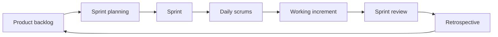
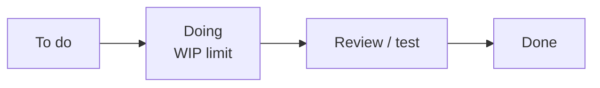
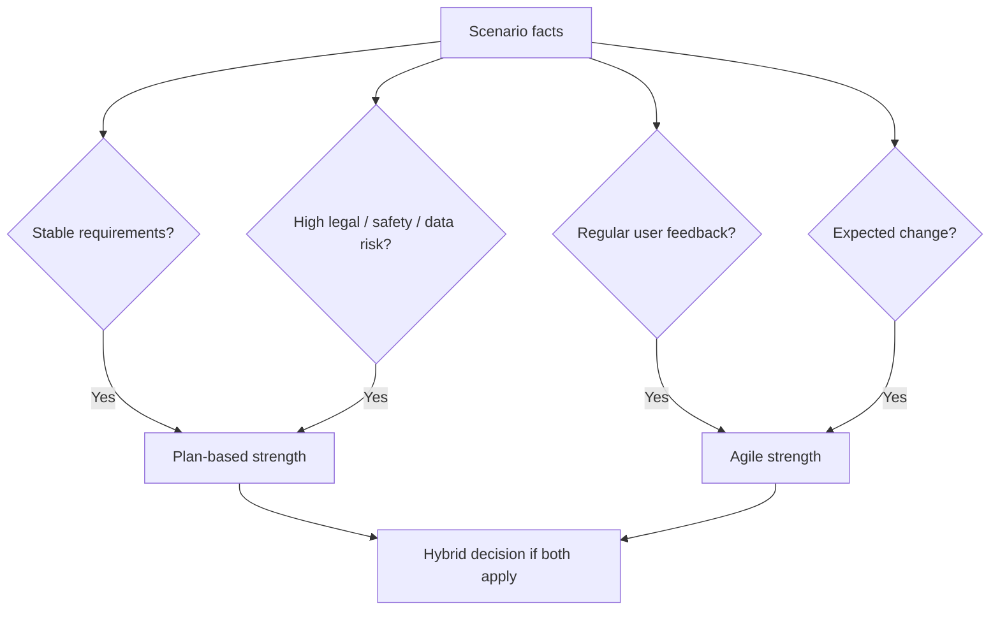
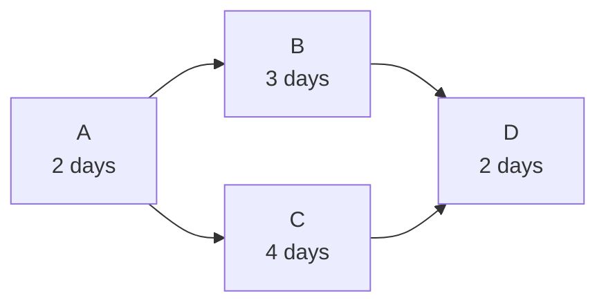

# Agile, Scrum, XP, Kanban, and Planning

## Traditional vs Agile Approaches

Traditional methods include waterfall, V-model, requirements tables, detailed UML/specifications, integration testing phases, formal user testing, and separate specialist teams. [L16 p47](<../Lecture Slides/16 - Agile vs Traditional and Maintenance.pdf#page=47>)

Agile methods include spiral/iterative ideas, Scrum, user stories, personas, rapid prototyping, TDD, CI, paired coding, frequent client interaction, and integrated skill teams. [L16 p47](<../Lecture Slides/16 - Agile vs Traditional and Maintenance.pdf#page=47>)

Traditional approaches became concerning when they were:
- heavy;
- top-down;
- slow;
- document-dependent;
- team-separated;
- expensive to change late;
- restrictive for developers;
- poorly suited to changing requirements. [L16 p48](<../Lecture Slides/16 - Agile vs Traditional and Maintenance.pdf#page=48>)

Agile does not mean "no method". It means selecting and adapting methods to fit the project, with frequent feedback and working software. [L16 p51](<../Lecture Slides/16 - Agile vs Traditional and Maintenance.pdf#page=51>)

## Rapid Software Development

Rapid software development interleaves specification, design, implementation, and stakeholder evaluation. [L16 p49](<../Lecture Slides/16 - Agile vs Traditional and Maintenance.pdf#page=49>)

It is useful because:
- users often discover what they need after seeing software;
- requirements change;
- markets and technologies move quickly;
- early feedback can prevent wasted work;
- partial working software can deliver value.

Risks:
- moving too fast without enough testing;
- weak documentation;
- unclear process visibility;
- poor stakeholder availability;
- uncontrolled change.

## Agile Manifesto Values

The four Agile Manifesto values are: [L16 p56](<../Lecture Slides/16 - Agile vs Traditional and Maintenance.pdf#page=56>)

1. Individuals and interactions over processes and tools.
2. Working software over comprehensive documentation.
3. Customer collaboration over contract negotiation.
4. Responding to change over following a plan.

Important exam warning:
Do not confuse values with principles. For example, simplicity and sustainable pace are principles, not the four headline values.

The phrase "over" does not mean the second thing is worthless. Agile still uses processes, tools, documentation, contracts, and plans; it values the first item more when trade-offs arise.

## Agile Principles

Agile principles include:
- early and continuous delivery of valuable software;
- welcoming changing requirements, even late in development;
- frequent delivery of working software;
- business people and developers working together regularly;
- building around motivated individuals;
- direct communication where possible;
- working software as the primary measure of progress;
- sustainable pace;
- simplicity;
- self-organising teams;
- regular reflection and improvement. [L16 p53](<../Lecture Slides/16 - Agile vs Traditional and Maintenance.pdf#page=53>) [L16 p54](<../Lecture Slides/16 - Agile vs Traditional and Maintenance.pdf#page=54>)

## Scrum

Scrum focuses on organising work into fixed time periods and delivering increments. [L16 p64](<../Lecture Slides/16 - Agile vs Traditional and Maintenance.pdf#page=64>)

Core Scrum concepts:
- Product backlog: prioritised list of desired work/features.
- Product owner: represents product/stakeholder priorities.
- Sprint: fixed time period, often 2-4 weeks. [L16 p71](<../Lecture Slides/16 - Agile vs Traditional and Maintenance.pdf#page=71>)
- Sprint planning: select work for the sprint.
- Development team: builds the increment.
- Daily scrum/stand-up: short coordination meeting about progress and blockers. [L16 p71](<../Lecture Slides/16 - Agile vs Traditional and Maintenance.pdf#page=71>)
- Scrum Master: facilitates Scrum and helps remove blockers. [L16 p71](<../Lecture Slides/16 - Agile vs Traditional and Maintenance.pdf#page=71>)
- Sprint review: demonstrate working software and get feedback.
- Retrospective: reflect on the process and improve.
- Increment: completed working output from a sprint.

## Scrum and Agile Values

Scrum reflects agile values:
- Individuals/interactions: daily communication and team coordination.
- Working software: each sprint aims for a working increment.
- Customer collaboration: product owner/stakeholder feedback influences priorities.
- Responding to change: backlog can be reprioritised between sprints.

Weak Scrum:
- performs ceremonies mechanically without feedback;
- has no real product owner or user access;
- produces documents/tasks but no working increment;
- ignores retrospectives;
- lets the backlog become unmanaged.

## Extreme Programming

Extreme Programming (XP) focuses on team effectiveness and technical practices. [L16 p64](<../Lecture Slides/16 - Agile vs Traditional and Maintenance.pdf#page=64>)

XP practices include:
- incremental planning;
- small releases;
- simple design;
- test-first development/TDD;
- refactoring;
- pair programming;
- collective ownership;
- continuous integration;
- sustainable pace;
- on-site customer or close customer representative. [L16 p67](<../Lecture Slides/16 - Agile vs Traditional and Maintenance.pdf#page=67>) [L16 p68](<../Lecture Slides/16 - Agile vs Traditional and Maintenance.pdf#page=68>)

XP maps to agile values:
- customer collaboration through close customer involvement;
- working software through frequent releases and TDD;
- individuals/interactions through pair programming and collective ownership;
- responding to change through refactoring and incremental planning. [L16 p69](<../Lecture Slides/16 - Agile vs Traditional and Maintenance.pdf#page=69>)

## Kanban

Kanban focuses on flow and speed of feature delivery. [L16 p64](<../Lecture Slides/16 - Agile vs Traditional and Maintenance.pdf#page=64>)

Kanban uses:
- a board showing work states;
- an updating priority list;
- pull-based work;
- work-in-progress limits;
- continuous flow rather than fixed sprint cycles;
- visibility of bottlenecks. [L16 p75](<../Lecture Slides/16 - Agile vs Traditional and Maintenance.pdf#page=75>) [L16 p76](<../Lecture Slides/16 - Agile vs Traditional and Maintenance.pdf#page=76>) [L16 p77](<../Lecture Slides/16 - Agile vs Traditional and Maintenance.pdf#page=77>)

Kanban is useful where:
- priorities change frequently;
- work items vary in size;
- continuous delivery matters;
- limiting overload is important.

## Combining Agile Techniques

Agile methods can be combined. [L16 p79](<../Lecture Slides/16 - Agile vs Traditional and Maintenance.pdf#page=79>)

Examples:
- Scrum team uses TDD;
- Scrum team uses a Kanban board;
- XP team uses CI and pair programming;
- plan-based project uses prototypes for uncertain requirements;
- regulated project uses formal requirements plus agile increments for UI feedback.

Good exam answers name the practices, not just "we used agile".

## User Stories

User stories express requirements from the perspective of a user goal.

Common form:
As a [type of user], I want [goal] so that [benefit].

User stories can support:
- requirements capture;
- sprint planning;
- implementation focus;
- acceptance criteria;
- user testing;
- documentation;
- prioritisation.

Good user stories should be understandable, user-centred, and testable through acceptance criteria.

Weak user stories:
- too vague;
- no user benefit;
- too large;
- purely technical with no user outcome;
- not linked to acceptance criteria.

## Choosing Agile or Plan-Based

Choose plan-based/traditional methods when:
- requirements are stable;
- high legal, safety, financial, or data-protection risk exists;
- formal documentation and sign-off are needed;
- teams are large, remote, or separated by specialist roles;
- external regulation or standards apply;
- careful analysis before implementation is necessary. [L16 p94](<../Lecture Slides/16 - Agile vs Traditional and Maintenance.pdf#page=94>) [L16 p95](<../Lecture Slides/16 - Agile vs Traditional and Maintenance.pdf#page=95>) [L16 p96](<../Lecture Slides/16 - Agile vs Traditional and Maintenance.pdf#page=96>)

Choose agile/iterative methods when:
- requirements are vague or changing;
- regular user/customer feedback is available;
- early increments can deliver value;
- the product is expected to evolve;
- the team can work closely together;
- prototypes are needed to explore possibilities. [L16 p94](<../Lecture Slides/16 - Agile vs Traditional and Maintenance.pdf#page=94>)

Hybrid reasoning is often strongest:
- formal requirements/security/testing for high-risk parts;
- agile prototypes/user stories/increments for uncertain or user-facing parts. [L16 p97](<../Lecture Slides/16 - Agile vs Traditional and Maintenance.pdf#page=97>) [L16 p99](<../Lecture Slides/16 - Agile vs Traditional and Maintenance.pdf#page=99>)

## Is Agile Faster or Cheaper?

Agile is not automatically faster or cheaper. [L16 p89](<../Lecture Slides/16 - Agile vs Traditional and Maintenance.pdf#page=89>) [L16 p100](<../Lecture Slides/16 - Agile vs Traditional and Maintenance.pdf#page=100>)

It can reduce waste by:
- getting early feedback;
- avoiding building unwanted features;
- delivering priority features first;
- finding requirement misunderstandings early;
- using CI/TDD to reduce late defects.

It can become slower or more expensive if:
- requirements churn constantly;
- there is poor coordination;
- documentation is too weak;
- testing is neglected;
- stakeholders are unavailable;
- rework overwhelms progress.

## Agile Pitfalls

Common pitfalls:
- treating agile as a ritual rather than adapting to the project;
- using user stories when another artefact would be clearer;
- replacing lightweight documentation with no documentation;
- insufficient design;
- weak testing;
- poor process visibility;
- lack of stakeholder involvement;
- unmanaged backlog;
- confusing speed with quality.

## Project Planning

Project planning documents can include:
- introduction;
- project organisation;
- risk analysis;
- hardware/software needs;
- work breakdown;
- schedule;
- monitoring and revision plans. [L19 p5](<../Lecture Slides/19 - Agile Planning and Project Management.pdf#page=5>)

Planning involves:
- defining the schedule;
- identifying risks and constraints;
- defining milestones and deliverables;
- doing work;
- monitoring progress;
- mitigating risks;
- replanning when needed. [L19 p6](<../Lecture Slides/19 - Agile Planning and Project Management.pdf#page=6>)

Breaking tasks down helps estimate people, duration, cost, dependencies, and risk. [L19 p3](<../Lecture Slides/19 - Agile Planning and Project Management.pdf#page=3>)

## PERT, Critical Path, Gantt, and Staff Allocation

PERT diagrams show tasks and dependencies. [L19 p11](<../Lecture Slides/19 - Agile Planning and Project Management.pdf#page=11>)

Critical Path Method identifies the dependency chain that determines project duration and schedule risk. [L19 p11](<../Lecture Slides/19 - Agile Planning and Project Management.pdf#page=11>)

Gantt charts add time to tasks and dependencies, showing when tasks start/end and where they overlap. [L19 p11](<../Lecture Slides/19 - Agile Planning and Project Management.pdf#page=11>)

Staff allocation charts show who can do the tasks and whether the schedule requires too many people at once. [L19 p11](<../Lecture Slides/19 - Agile Planning and Project Management.pdf#page=11>)

```mermaid
gantt
    title Example Gantt Chart
    dateFormat  X
    axisFormat  Day %s
    section Critical path
    A :a, 0, 2
    C :crit, c, after a, 4
    D :crit, d, after c, 2
    section Non-critical
    B :b, after a, 3
```

## Planning Calculation Method

1. List tasks, durations, dependencies, and staffing needs.
2. Determine earliest start for each task.
3. Determine earliest finish for each task.
4. Find the longest dependency chain: the critical path.
5. The critical path duration is the shortest possible project duration.
6. Identify slack in non-critical tasks.
7. Check overlapping tasks for staff conflicts.
8. Move non-critical tasks within slack to fix staffing clashes.
9. Explain whether the project duration changes.

Useful phrases:
- A critical-path task cannot be delayed without delaying the whole project.
- Slack is the time a non-critical task can move without changing the project finish.
- A staffing conflict occurs when simultaneous tasks require more staff than are available.

## Industry Practice Links

The industry-experience reading connects agile theory to practice:
- remote teams use tools such as Teams, Jira, and GitHub;
- daily stand-ups support communication;
- Jira/issues support traceability;
- feature branches isolate work;
- CI/CD and automated tests improve speed and accuracy before live deployment. [RR-IND](<../Required Reading Notes/01 - Required Reading Findings.md>)

Use these examples in applied questions instead of vague claims like "agile helps teamwork".

## Exam Angles

- If asked Agile Manifesto values, write the four exact values.
- If asked Scrum, mention backlog, product owner, sprint planning, sprint, daily scrum, Scrum Master, review, retrospective, increment.
- If asked XP, mention TDD, pair programming, refactoring, small releases, simple design, CI, collective ownership, sustainable pace, and customer involvement.
- If asked Kanban, mention board, pull, changing priorities, flow, and work-in-progress limits.
- If asked agile vs plan-based, use scenario facts: risk, regulation, uncertainty, user access, team size, documentation, and expected change.
- If asked whether agile is faster/cheaper, give a balanced answer.
- If asked planning maths/diagrams, focus on dependencies, critical path, Gantt timing, slack, and staff allocation.
