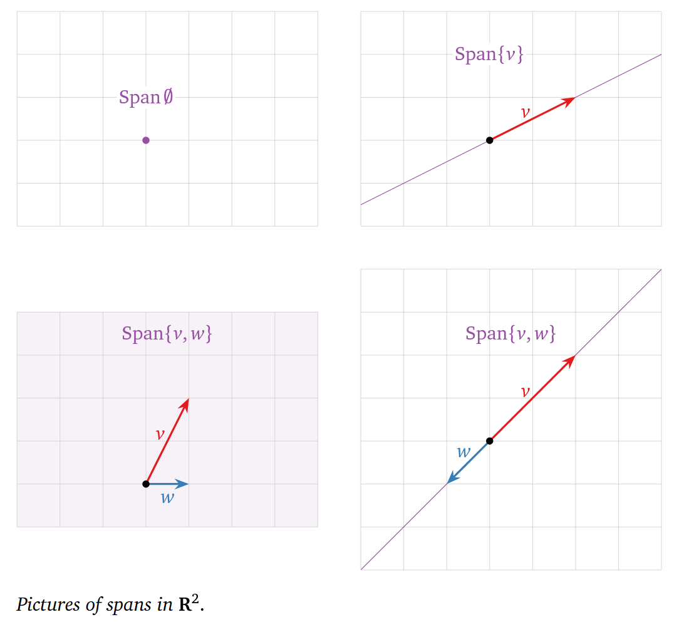
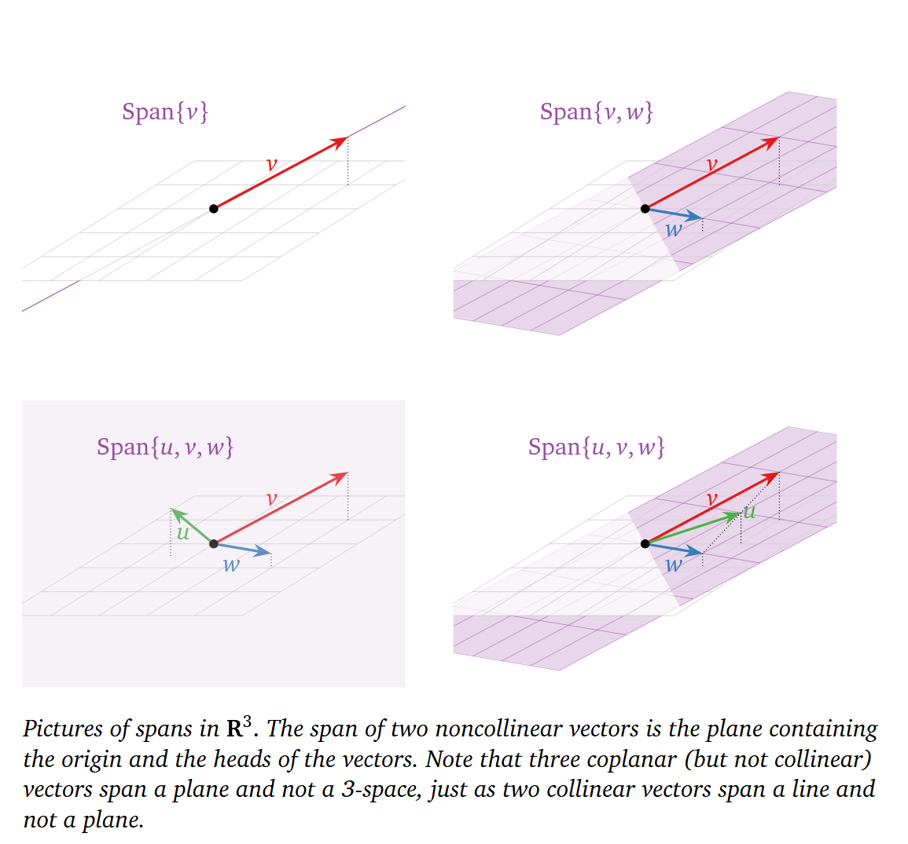

# Span

## Definition

A span is the set of all linear combinations of a given set of vectors.

$$
\operatorname{Span}\{\mathbf{v}_1, \mathbf{v}_2, \dots, \mathbf{v}_k\}
=
\{x_1\mathbf{v}_1 + x_2\mathbf{v}_2 + \cdots + x_k\mathbf{v}_k \mid x_1,\dots,x_k \in \mathbb{R}\}.
$$
## Pictures of Spans

  
  

## Note

Any span must contain the origin, since we can choose all coefficients to be zero:

$$
0\mathbf{v}_1 + 0\mathbf{v}_2 + \cdots + 0\mathbf{v}_k = \mathbf{0}.
$$

So the zero vector is always in

$$
\operatorname{Span}\{\mathbf{v}_1, \mathbf{v}_2, \dots, \mathbf{v}_k\}.
$$

This is one reason every [[Span|span]] is a [[Subspace|subspace]].

## Why It Matters

To ask whether a vector $\mathbf{b}$ is in a span is the same as asking whether a related vector or matrix equation is [[Consistent System|consistent]].

## Appears In

- [[1 Vectors & Spans]]
- [[2.4 Matrix Equations]]
- [[3.1 Solution Sets and Subspaces]]

## Related

- [[Linear Combination]]
- [[Matrix Equation]]
- [[Subspace]]
